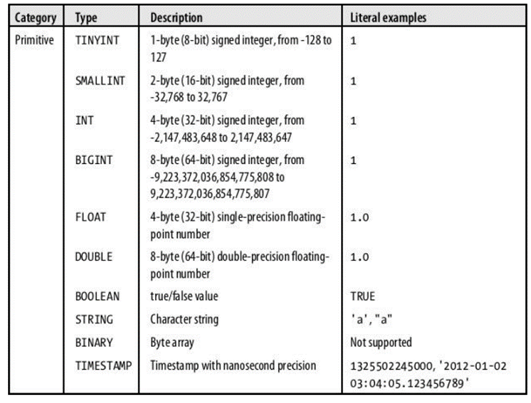
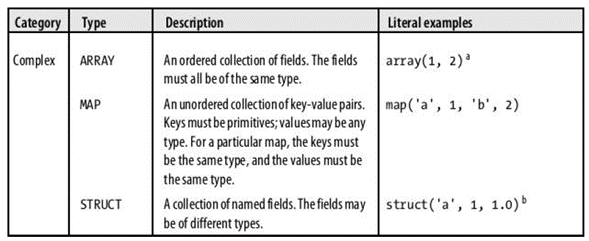
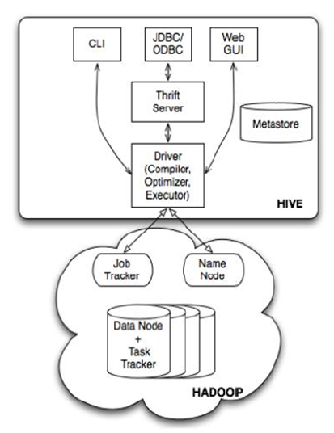
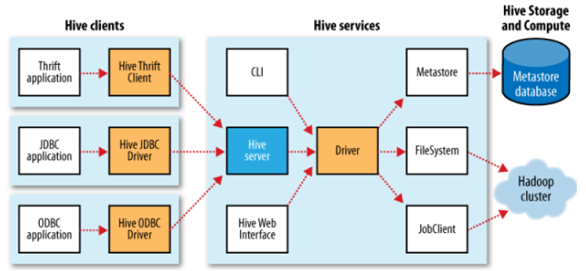

# Fiche de révision des définitions

## Table des matières

<!-- TOC -->

- [Fiche de révision des définitions](#fiche-de-r%C3%A9vision-des-d%C3%A9finitions)
  - [Table des matières](#table-des-mati%C3%A8res)
  - [Architecture Big Data](#architecture-big-data)
    - [Big Data Données massives](#big-data-donn%C3%A9es-massives)
      - [Règle des 3V](#r%C3%A8gle-des-3v)
      - [Règle des 4V](#r%C3%A8gle-des-4v)
      - [Règle des 5V](#r%C3%A8gle-des-5v)
    - [BI Business intelligence ou l'informatique décisionnelle](#bi-business-intelligence-ou-linformatique-d%C3%A9cisionnelle)
    - [Modélisation des données](#mod%C3%A9lisation-des-donn%C3%A9es)
    - [Modélisation dimensionnelle](#mod%C3%A9lisation-dimensionnelle)
    - [Stockage de données dans le cloud](#stockage-de-donn%C3%A9es-dans-le-cloud)
    - [Stockage en réseau](#stockage-en-r%C3%A9seau)
    - [Stockage en cluster](#stockage-en-cluster)
    - [NAS](#nas)
    - [NFS](#nfs)
    - [SAN](#san)
    - [Système de fichiers distribué](#syst%C3%A8me-de-fichiers-distribu%C3%A9)
    - [Hadoop](#hadoop)
    - [HDFS](#hdfs)
    - [MapReduce](#mapreduce)
    - [Les outils de l’écosystème d’Hadoop](#les-outils-de-l%C3%A9cosyst%C3%A8me-dhadoop)
      - [Cloudera](#cloudera)
      - [Spark](#spark)
    - [Power BI](#power-bi)
    - [Entrepôt de données](#entrep%C3%B4t-de-donn%C3%A9es)
    - [Cycle de vie dimensionnel d’un Entrepôt de données](#cycle-de-vie-dimensionnel-dun-entrep%C3%B4t-de-donn%C3%A9es)
    - [Entrepôt de Données de Santé](#entrep%C3%B4t-de-donn%C3%A9es-de-sant%C3%A9)
    - [Mesures, Faits, Dimensions et Modèles](#mesures-faits-dimensions-et-mod%C3%A8les)
    - [Les architectures Big Data](#les-architectures-big-data)
      - [Les composantes d’une architecture Big Data](#les-composantes-dune-architecture-big-data)
      - [Principaux types d’architecture Big Data](#principaux-types-darchitecture-big-data)
  - [Intégration des données](#int%C3%A9gration-des-donn%C3%A9es)
    - [Référentiel de stockage](#r%C3%A9f%C3%A9rentiel-de-stockage)
    - [DataMart](#datamart)
      - [Mise en place](#mise-en-place)
    - [Architecture d'un système décisionnel](#architecture-dun-syst%C3%A8me-d%C3%A9cisionnel)
    - [Principe d’un entrepôt de donnée Datawarehouse](#principe-dun-entrep%C3%B4t-de-donn%C3%A9e-datawarehouse)
    - [ETL](#etl)
      - [Les zones de travail d’un ETL](#les-zones-de-travail-dun-etl)
      - [Extraction](#extraction)
      - [Transformation](#transformation)
      - [Chargement](#chargement)
    - [Les outils ETL](#les-outils-etl)
    - [Analyse décisionnelle : de l’OLTP à l’OLAP](#analyse-d%C3%A9cisionnelle--de-loltp-%C3%A0-lolap)
    - [Talend For Big Data](#talend-for-big-data)
  - [Modèle physique et optimisation](#mod%C3%A8le-physique-et-optimisation)
    - [Rappel des propriétés ACID](#rappel-des-propri%C3%A9t%C3%A9s-acid)
    - [Théorème de Brewer dit "théorème de CAP"](#th%C3%A9or%C3%A8me-de-brewer-dit-th%C3%A9or%C3%A8me-de-cap)
    - [NoSQL](#nosql)
      - [Modèle orienté colonne](#mod%C3%A8le-orient%C3%A9-colonne)
      - [Modèle orienté-documents](#mod%C3%A8le-orient%C3%A9-documents)
      - [Modèle orienté-graphes](#mod%C3%A8le-orient%C3%A9-graphes)
      - [Modèle orienté clé-valeur](#mod%C3%A8le-orient%C3%A9-cl%C3%A9-valeur)
    - [Hive](#hive)
    - [HiveQL](#hiveql)
    - [Types de données](#types-de-donn%C3%A9es)
      - [Types de données primitifs de HiveQL](#types-de-donn%C3%A9es-primitifs-de-hiveql)
      - [Types de données complexes](#types-de-donn%C3%A9es-complexes)
    - [Architecture de Hive](#architecture-de-hive)
    - [Partitionnement](#partitionnement)
    - [Bucket](#bucket)
    - [Apache Hive : avantages](#apache-hive--avantages)
    - [Les limites de Hive](#les-limites-de-hive)
    - [Vues dans Hive](#vues-dans-hive)

<!-- /TOC -->

---

## Architecture Big Data

### Big Data (Données massives)

Le Big Data est un type de base de données ayant des caractéristiques spécifiques. Trois règles ont été utilisées pour définir le Big Data. Il s’agit des règles « 3V », « 4V » et « 5V » :

#### Règle des 3V

En 2012, Gartner définit les enjeux inhérents à la croissance des données comme étant tridimensionnels. Il s’agit du Volume, de la Variété et de la Vélocité d’où cette définition : « Les Big Data sont des données volumineuses, très variées, générées et traitées à grande vitesse. Ces données exigent des formes efficaces et innovantes de traitement de l'information pour permettre une meilleure prise de décision ».

#### Règle des 4V

Quatre dimensions pour caractériser le Big Data, à savoir : le Volume, la Variété, la Vélocité et la Valeur. Définition : « Les Technologies Big Data décrivent une nouvelle génération de technologies et d’architectures conçues pour extraire économiquement de la valeur à partir de grands volumes de données très variées, en permettant leur capture et leur analyse à grande vitesse ».

#### Règle des 5V

Deux nouveaux V sont apparus en 2013 avec une définition plus large pour le Big Data au travers de la règle des 5V : « Les Technologies Big Data visent à traiter des données de grand volume, grande vélocité et grande variété pour extraire de la valeur, assurer une forte véracité des données originales et obtenir des informations qui exigent des formes novatrices de traitement des données, afin d’améliorer la prise de décision et le contrôle des processus »

Les définitions associées aux dimensions utilisées dans les règles ci-dessus sont les suivantes :

- **Volume** : représente la taille de l'ensemble des données à traiter,
- **Variété** : fait référence à la diversité des sources, des types et des formats de données,
- **Vélocité** : correspond à la vitesse à laquelle les données sont collectées et traitées,
- **Valeur** : équivaut au profit que l'on peut tirer de l'usage des Big Data,
- **Véracité** : recouvre la qualité et la fiabilité des données ; c'est la dimension qualitative des Big Data.

### BI (Business intelligence ou l'informatique décisionnelle)

L’informatique décisionnelle, également Business Intelligence ou BI en anglais, désigne les moyens, les méthodes et les outils qui apportent des solutions en vue d’offrir une aide à la décision aux professionnels afin de leurs permettre d’avoir une vue d’ensemble sur l’activité de l’entreprise et de leurs permettre de prendre des décisions plus avisées à travers des tableaux de bord de suivi et des analyses.

### Modélisation des données

La modélisation des données (data modeling en anglais) est un processus de description de la structure, des associations, des relations et des contraintes relatives aux données disponibles. Elle sert à établir des normes et à coder des règles de gestion (modèles) des données dans l’organisation. Le data modeling fait partie intégrante de la phase de planification de tout déploiement analytique dans l’organisation ou de projet de Business Intelligence. Qu’est-ce qu’un modèle de données ? Dans le processus de modélisation, l’accent est mis sur le besoin de disponibilité et d’organisations des données et non sur la manière dont celles-ci seront utilisées.

### Modélisation dimensionnelle

La conception du modèle conceptuel de données commence par la définition et l’analyse des besoins qui détermine quelles sont les données requises pour répondre aux besoins d'analyse des utilisateurs. Le résultat de cette analyse est le modèle dimensionnel. Ce modèle identifie la granularité de la table de faits, associées aux dimensions avec leurs attributs et leurs hiérarchisations.

### Stockage de données dans le cloud

Le stockage dépend généralement de la technologie de virtualisation utilisée, et surtout de sa « profondeur ». Dans les technologies d'isolation, la virtualisation se fait au niveau de l'OS, et ne nécessite pas un dispositif de stockage particulier : chaque environnement virtualisé se présente sous la forme d'une arborescence gérable depuis le domaine de contrôle. Cette arborescence peut de façon transparente, être située physiquement sur la même machine, sur un autre disque, sur un serveur distant, sur un réseau de stockage, etc. C'est la solution qui offre la plus grande souplesse. Dans les technologies de machine virtuelle, l'hyperviseur ne fournit au système virtualisé qu'un espace de stockage. Il peut s'agir d'un volume, ou simplement d'un fichier, mais dans les deux cas cet espace est «hermétique» et ne peut être accédé depuis le domaine de contrôle. Là encore, on peut placer l'intégralité de cet espace sur un disque local, un réseau de stockage, un autre serveur...

### Stockage en réseau

Dans ce type de stockage, les hyperviseurs sont généralement gérés sous forme de « pools », formant une « force de travail » globale qui se partageront les machines virtuelles à exécuter. Disposant d'un réseau de stockage, chaque hyperviseur a accès à toutes les machines virtuelles, et peut donc exécuter n'importe laquelle, et la transférer sans interruption à un autre hyperviseur en fonction de sa charge.

### Stockage en cluster

Dans ce type de stockage, les hyperviseurs sont gérés sous forme de « clusters », formant une « force de travail » globale qui se partageront les machines virtuelles à exécuter. Disposant d'un réseau de stockage, chaque hyperviseur a accès à toutes les machines virtuelles, et peut donc exécuter n'importe laquelle, et la transférer sans interruption à un autre hyperviseur en fonction de sa charge.

### NAS

Un NAS ou stockage réseau (Network-Attached Storage), est simplement un serveur fournissant leurs fichiers à d'autres serveurs par le réseau.

### NFS

NFS est le standard universel pour l'accès aux fichiers sur un réseau, c'est le protocole le plus utilisé dans les NAS.

### SAN

Un SAN, ou réseau de stockage (Storage Area Network), est un réseau sur lequel circulent les données entre un système et son stockage. Cette technique permet de déporter tout le stockage interne d'une machine vers un équipement dédié.

### Système de fichiers distribué

C'est un système où le poste client accède à un espace de stockage virtuel unique. Les données peuvent être réparties/dupliquées sur plusieurs machines de façon transparente pour celui-ci. C'est le moteur du système de fichiers distribué qui a la charge de répartir les données et de les dispatcher au client. Les systèmes de fichier distribués les plus répandus sont :

- Ceph
- GlusterFS
- Hadoop Distributed File System (HDFS)
- Lustre (utilisé par les super-calculateurs)
- NFS - Network File System

### Hadoop

Hadoop est un système logiciel distribué capable de stocker et traiter de manière séquentielle, et à des coûts raisonnables, des volumes de données de plusieurs péta-octets. Il offre une grande flexibilité (possibilité d’enlever et d’ajouter des machines) et ses performances évoluent de manière quasi linéaire en fonction du nombre de machines constituant le cluster. Hadoop a été écrit en Java, qui demeure le langage de prédilection pour les développeurs de programme Hadoop.

### HDFS

Il s’agit d’un système de gestion de fichiers distribué, inspiré par GFS le système de gestion de fichiers de Google. HDFS est le composant d’Hadoop en charge du stockage de données dans le cluster. Les composantes de HDFS : HDFS se compose d’un ensemble de nœuds :

- **NameNode** : est un nœud maître qui s’occupe de gérer l’état de HDFS. Le NameNode est responsable de la répartition des données sur les DataNode et de la gestion de l’espace mémoire du cluster. Il héberge les métadonnées qui représentent l’ensemble d’information sur l’emplacement des blocs de données, leurs propriétés et les autorisations.
- **SecondaryNameNode** : est aussi un nœud maître. Le SecondaryNameNode est chargé de la maintenance des nœuds du cluster, où il garde sous contrôle l’espace disque utilisé, limite la charge processeur du NameNode et permet la continuité de fonctionnement du cluster Hadoop en cas de panne.
- **DataNode** : est le nœud esclave implanté sur chaque machine du cluster qui n’est pas un nœud maître. Le DataNode héberge une partie des données du cluster Hadoop afin d’assurer une haute disponibilité des données.

### MapReduce

MapReduce est un modèle de programmation conçu pour la lecture et le traitement d’un volume de données très important. Il implémente au sein d’Hadoop diverses fonctionnalités : la division des tâches en parallèle, leurs répartitions et la collecte des résultats. Un programme MapReduce se constitue de fonction map et reduce. La fonction map fait la lecture des données stockées sur disque et les traite. La fonction reduce consolide les résultats issus de la fonction map puis les écrit sur le disque. Les données MapReduce sont lues ou écrites selon le format <clé, valeur>. L’exécution d’un programme MapReduce sur un ensemble de données désigne le job Hadoop. Les composantes de MapReduce : Une tâche, au sens Hadoop du terme, est une tâche map ou une tâche reduce. Chaque tâche traite une partie seulement de l’ensemble des données du cluster. L’exécution de ces tâches est contrôlée par un ensemble de nœuds maîtres et esclaves qui sont :

- **JobTracker** : est le nœud maître responsable du lancement des tâches d’un job Hadoop et de leurs coordinations au niveau des nœuds esclaves. Il est aussi chargé de planifier l’exécution des jobs Hadoop, l’agrégation de leurs résultats et de la gestion de l’état du TaskTracker.
- **TaskTracker** : est le nœud esclave en charge de l’exécution des tâches map et reduce qui lui sont assignées par le JobTracker. Des rapports journaliers regroupant l’ensemble d’informations sur l’exécution des tâches MapReduce sont tenus par le JobTracker, ce qui garantit une facilité de réinitialisation des tâches en cas de défaillance d’un nœud TaskTracker. L’ensemble des nœuds maîtres et esclaves des deux composantes HDFS et MapReduce constituent les composantes du cluster Hadoop.

### Les outils de l’écosystème d’Hadoop

L’écosystème de Hadoop comprend de nombreux outils en supplément de HDFS et MapReduce, tels que représentés dans la figure ci-dessous. Les outils d’Hadoop peuvent être classés en trois grandes catégories :

- Les outils orientés bases de données (Hbase, Scoop,...)
- Les outils de Requêtage et scripting des données Hadoop (Hive, Pig, API Streaming)
- Les outils d’exploitation (Zookeeper, Oozie)

#### Cloudera

Cloudera est une entreprise Américaine basée en Californie, elle se consacre au développement d’une solution Big Data basée historiquement sur le framework distribué Hadoop et qui est en train de se réorienter vers le Cloud. Cloudera développe depuis plus d’un an sa solution dans les Cloud publiques AWS, Azure et GCP.

#### Spark

Apache Spark est un framework open source de calcul distribué conçu pour être rapide et général. Il fournit des API de haut niveau en Java, Scala, Python et R, et un moteur optimisé qui prend en charge la génération de graphiques de traitement de données en parallèle. Il prend en charge une grande variété de charges de travail, notamment le traitement de flux, le traitement par lots, l'apprentissage automatique et l'analyse interactive.

### Power BI

Power BI est un ensemble de services logiciels, d’applications et de connecteurs qui œuvrent ensemble pour transformer des sources de données disparates en informations visuelles immersives et interactives. Vos données peuvent être sous forme de feuille de calcul Excel ou de collection d’entrepôts de données hybrides locaux ou sur le cloud. Power BI vous permet de vous connecter facilement à vos sources de données, de visualiser et de découvrir ce qui est important, et de partager ces informations avec qui vous voulez.

### Entrepôt de données

C’est un ensemble de magasin de données représentant une collection de données intégrées, variant selon le temps et non volatiles, qui sert de support au processus de prise de décision. La notion d’entrepôts de données a été introduite pour la première fois par Bill. Les données de cette base de données sont intégrées, contenant des informations historisées, non volatiles et destinées à la prise de décision.

### Cycle de vie dimensionnel d’un Entrepôt de données

Les experts dans le domaine adhèrent à la règle que les méthodologies de développement des systèmes décisionnels sont différentes de celles utilisées pour les autres systèmes (transactionnels par exemple). Par ailleurs, un plan de projet global tel que le Cycle de Vie Dimensionnel (CVD) qui permet de mettre en place une solution décisionnelle complète de l'extraction à l'exploitation de l'information.

### Entrepôt de Données de Santé

Il intègre les données administratives et médicales des millions de patients hospitalisés ou venus en consultation dans les établissements de France.

### Mesures, Faits, Dimensions et Modèles

Les termes "mesures", "faits" et "dimensions" sont des concepts fondamentaux utilisés pour organiser et analyser les données. Ils permettent de créer des rapports, des tableaux de bord, des analyses et des visualisations pour prendre des décisions informées dans le domaine de l'informatique décisionnelle. Ces concepts sont au cœur de la modélisation des données dans les entrepôts de données et des systèmes de business intelligence :

- **Mesures** (ou indicateurs) : Les mesures sont des données quantitatives qui représentent les informations que vous souhaitez analyser. Ce sont les données numériques ou les valeurs sur lesquelles vous souhaitez effectuer des calculs, des agrégations ou des analyses. Par exemple, dans une entreprise, les ventes mensuelles, les revenus, les coûts, la marge bénéficiaire, etc., sont des exemples de mesures.
- **Faits** : Les faits sont des enregistrements ou des lignes de données qui contiennent les mesures associées à un événement ou une transaction spécifique. Les faits sont souvent stockés dans des tables de faits et sont liés à des dimensions pour donner du contexte aux mesures. Par exemple, dans un magasin de données pour la vente au détail, un fait pourrait être une transaction de vente spécifique, et les mesures associées pourraient inclure le montant de la vente, le produit vendu, la date de la transaction, etc.
- **Dimensions** : Les dimensions sont des attributs ou des caractéristiques qui fournissent un contexte aux mesures. Elles permettent de segmenter, de filtrer et d'analyser les mesures. Les dimensions sont souvent organisées en hiérarchies. Par exemple, dans une analyse de ventes, les dimensions pourraient inclure le temps (année, trimestre, mois, jour), le produit (catégorie, marque, modèle), la géographie (pays, région, ville), etc.
- **Modèles dimensionnels** : Les entrepôts de données (data warehouses) utilisent différents modèles pour organiser et stocker les données de manière à faciliter l'analyse et la prise de décision. Voici quelques-uns des modèles couramment utilisés :
  - Modèle en étoile (Star Schema) : Ce modèle est l'un des plus populaires pour les entrepôts de données. Il se caractérise par une table centrale de faits (fact table) contenant les mesures ou les faits, entourée de tables de dimensions (dimension tables) qui décrivent les éléments contextuels des données.
  - Modèle en flocon (Snowflake Schema) : Le modèle en flocon est une variation du modèle en étoile dans lequel les tables de dimensions sont normalisées en sous-dimensions, créant une structure hiérarchique. Cela peut aider à économiser de l'espace de stockage, mais cela peut rendre les requêtes plus complexes
  - Modèle en constellation (Constellation Schema) : Ce modèle consiste en plusieurs schémas en étoile interconnectés, chacun représentant un domaine de données spécifique. Il est utilisé lorsque vous avez des domaines de données distincts qui partagent certaines informations.

### Les architectures Big Data

Les systèmes de bases de données traditionnels ne permettent plus de répondre aux exigences imposées par le Big Data. Ils ne sont pas en mesure de traiter des volumes de données aussi massifs et assez rapidement. C’est pourquoi, pour pouvoir profiter des avantages du Big Data, il faut repousser les limites des systèmes notamment en termes de volume, de vitesse de traitement et de variété des données à manager. Pour cela, il faut adapter la structure son écosystème informatique traditionnel et mettre en place une architecture Big Data. En mettant en place une architecture Big Data adaptée dans son entreprise, une organisation va pourvoir effectuer :

- Un traitement en batch des sources de Big Data
- Un traitement en temps réel des Big Data en mouvement
- Une exploration des données volumineuses
- Une centralisation des data issues de différentes sources et existantes sous différents formats
- Des analyses prédictives
- Des tâches basées sur les technologies du Big Data et de l’intelligence artificielle

#### Les composantes d’une architecture Big Data

La plupart des architectures de données volumineuses incluent tout ou partie des éléments suivants :

- Source de données (data mart, data warehouse, cloud, base de données hybride)
- Stockage (magasin de données, data lake)
- Batch processing (traitement par lots)
- Stream processing (traitement de flux de données)
- Préparation de données
- Data catalog
- Modélisation de données
- Technologie d’orchestration

#### Principaux types d’architecture Big Data

Dans le domaine des Big Data, il existe des problématiques auxquelles aucune technologie, utilisée seule, ne peut apporter de réponse globale. Ainsi, le choix d’une technologie et l’usage qui en sera fait sera en général soumis à deux questions préalables : l’outil est-il évolutif ? Existe-il une courbe d’apprentissage liée à l’expérience de cette technologie, qui permette une réduction des temps de production, dans le temps ? Des architectures big data, comme l’architecture Lambda par exemple, ont donc été conçues pour résoudre des problématiques parfois complexes nécessitant l’intervention de plusieurs technologies. Ces architectures pourraient être comparées aux design patterns dans les langages objets. Les design patterns permettent de répondre à des enjeux liés à la conception d’un programme pouvant garantir la réutilisation et la pérennité du code. Ci-dessous sont listés les types d’architecture qui répondent aux besoins de traitement, de sauvegarde et/ou d’analyse de données :

- Architecture Datalake
- Architecture Lambda
- Architecture Kappa

Il s’agit d’une architecture distribuée qui gère de grosse quantité de données. Cela nous ramène à la problématique de stockage qui dépasse les capacités de traitement et de stockage des systèmes traditionnels qui n’utilisent qu’une machine unique, pour cela, il est nécessaire de mettre en place des architectures dites distribuées. Concrètement, cela revient à diviser la charge de stockage et de traitement d’une machine sur plusieurs machines afin de gagner en rapidité, en réactivité et en performance. Ainsi les solutions Datalake, Lambda et Kappa reposent sur ce système puisque, comme précisé ci-dessous, les tâches d’intégration, de traitement et de stockage sont réparties en plusieurs couches.

- **L’architecture Datalake** :
  Le Datalake (ou lac de données) est une architecture apparue avec les technologies Big Data, permettant le stockage de gros volumes de données. Le Datalake offre aux entreprises un système de stockage permettant d’accueillir tous types de données (brutes ou non) qu’elles soient structurées, semi-structurées et/ou non structurées. Cette architecture big data permet ainsi une transformation et un raffinement rapide des données stockées, que le volume traité soit important ou non. Celle-ci pourrait être définie en un mot : adaptable. Bien que n’étant pas le seul, Hadoop reste le framework de référence le plus utilisé pour la construction d’un Datalake. Les données peuvent provenir de multiples sources comme des logs, des services web, etc. Les différents systèmes d’ingestion consommeront les données pour ensuite les insérer dans le Datalake (HDFS). Une fois que les données sont enregistrées, les systèmes d’interrogations pourront alors interroger le Datalake.

- **L’architecture Lambda** :
  Créée par Nathan Marz, c’est l’architecture la plus couramment utilisée pour le traitement et la gestion des données volumineuses en temps réel et par lots de manière simultanée. L’architecture Lambda se découpe en 3 couches :

- Couche batch (Batch Layer) :
  - Stockage de l’ensemble des données
  - Traitements massifs et réguliers
  - La fréquence des traitements ne doit pas être trop importante afin de minimiser les tâches de fusion des résultats pour constituer les vues
- Couche temps réel (Speed Layer) :
  - Traite tout type de donnée reçu en temps réel
  - Calcule des vues incrémentales qui vont compléter les vues batch afin de fournir des données plus récentes
  - Suppression des vues temps réel obsolètes (postérieures à un traitement batch)
- Couche de service (Serving Layer) :

  - Permet de stocker et d’exposer aux clients les vues créées par les couches batch et temps réel
  - Adapté à tous types de bases NoSQL
    L’architecture Lambda sera souvent utilisée pour obtenir une vision complète des données.

- **L’architecture Kappa**

  L’architecture KAPPA a été pensée pour pallier la complexité de l’architecture Lambda. Elle repose sur le principe de fusion de la couche temps réel et batch, ce qui la rend moins complexe que l’architecture Lambda. Ne permettant pas le stockage de manière permanente, cette architecture est faite pour le traitement de données. Kappa n’étant également pas liée à une seule technologie, vous pouvez y associer différents outils, comme le montre le schéma ci-dessous :

- Stockage/temps réel : Kafka permet la sauvegarde des messages pour pouvoir ensuite les retraiter
- Traitements : Storm, Spark
- Couche de service : Cassandra, Hive, HBase, Outil maison, etc…

---

## Intégration des données

### Référentiel de stockage

Il représente le stockage d’une grande quantité de données dans un dépôt qui va être la source d'information principale, voire unique, d'un certain nombre d'applications. Dans le jargon du Big Data, un tel dépôt est appelé un Data Lake.

### DataMart

C'est une BDD décisionnelle moins coûteuse que l’Entrepôt de données, et plus légère puisqu’il est destiné à quelques utilisateurs d'un département. C'est une petite structure très ciblée et pilotée par les besoins des utilisateurs. Il a la même vocation que l’Entrepôt de données (il fournit une architecture décisionnelle), mais vise une problématique précise avec un nombre d'utilisateurs plus restreint. Le tableau ci-dessous donne des éléments de comparaison entre un Entrepôt de données et un Datamart :

#### Mise en place

- Construire un ou plusieurs Datamarts départementaux au lieu d'un Entrepôt de données central permet de valider rapidement le concept d'informatique décisionnelle.

- Les Datamarts sont petits, moins complexes et plus faciles à déployer que les Entrepôts de données. Les différents Datamarts indépendants peuvent être dynamiquement couplés pour se métamorphoser en Entrepôt de données.

- Les Datamarts ne se résument qu'à une seule information métier (exemple : suivi d’un budget d’investissement).

### Architecture d'un système décisionnel

Tout système décisionnel est architecturé globalement de la même façon :

En amont un accès au système transactionnel en lecture seule

    - Un DataWarehouse fusionnant les données requises
    - Un ETL permettant d'alimenter le DW à partir des données existantes
    - Des applications d'exploitation de reporting, exploration et/ou prédiction
    - D'éventuels DataMart permettant de simplifier le DW en vue de certaines applications

    -Quelques exemples d'application

        - Analyse du comportement de consommateurs ou de citoyens, en fonction de leurs caractéristiques (sexe, age...), de critères socio-économiques (profession...), géographiques...

        - Analyse de ventes en fonction de l'implantation géographique de magasins (densité, caractéristiques des régions...), de l'organisation de magasins (rayonnage, marketing, RH...)

        - Analyse des structures de paniers (quel produit est vendu en même temps que quel autre à quelles conditions ?)

        - Prédiction de ventes en fonctions de données conjoncturelles, gestion des stocks, des approvisionnements

        - Contrôle qualité et analyse de défaut des chaînes de production en fonction des centres de production, des organisations, des fournisseurs...

### Principe d’un entrepôt de donnée (Datawarehouse)

Un Entrepôt de données (ou Datawarehouse) répond aux problèmes de données surabondantes et localisées sur de multiples systèmes hétérogènes, c’est une architecture capable de servir de fondation aux systèmes décisionnels. Pour être exploitables, toutes les données provenant des systèmes distribués doivent être organisées, coordonnées, intégrées et enfin stockées pour donner à l’utilisateur une vue globale des informations (voire la figure ci-dessou). Cette approche est aussi appelée « Approche d’intégration matérialisée » vu que les données extraites seront dupliquées physiquement dans l’Entrepôt.

### ETL

L'ETL (Extraction Transformation Loading) est le processus de copie des données depuis les tables des systèmes transactionnels vers les tables du modèle en étoile du datawarehouse.

Exemple de modèle dimensionnel final à traiter avec l’ETL à partir d’un schéma d’une source de données :

#### Les zones de travail d’un ETL

Une architecture d'ETL organisée avec trois zones composées chacune d'une base de données distincte :

    - Zone d'extraction : Une base de données destinée à unifier les sources de données et offrir un point d'accès unique.

    - Zone de transformation : Une base de données destinée à traiter les sources et offrir une interface d'accès aux données transformées (API).

    - Zone d'exploitation : Une base de données destinée à implémenter le datawarehouse et les datamarts.

Ci-dessous le processus d’ETL en image :

#### Extraction

Il est en effet rare d’alimenter un Entrepôt de données à partir d’une unique source opérationnelle. L’ETL permet d’interconnecter un environnement technique hétérogène constitué de différentes BDD et de fichiers. Le processus d’extraction est souvent périodique. Un fichier de données est créé à des moments déterminés (exemple: quotidiennement ou mensuellement) et contient uniquement les modifications incrémentales dans les données sources (c’est-à-dire depuis l’extraction précédente). Si le système source prévoit une indication de temps, l’extraction pourra s’en servir utilement. Si non, d’autres méthodes plus complexes seront nécessaires, telles que le scannage de fichiers log ou la comparaison d’images « BEFORE » et « AFTER »

#### Transformation

Une fois que les données sont extraites, elles subissent une série de traitements de manière à les rendre présentables pour les utilisateurs et dignes d’intérêt pour l’entreprise. Parmi ces transformations on trouve:

    - Le mapping (pour adapter les données à la structure cible);

    - Le calcul (pour mettre en oeuvre les règles de gestion identifiées);

    - La création d’agrégats (parfois nécessaire pour améliorer les performances);

    - La dé-normalisation et la normalisation;

    - La conversion des types de données,… etc.

#### Chargement

Comme dans l’extraction, les services de chargement doivent être compatibles avec les divers environnements cibles. Le chargement doit être complet depuis la création des tables jusqu’à l’indexation.

### Les outils ETL

Les outils ETL sont des logiciels qui permettent de réaliser les opérations d’extraction, de transformation et de chargement des données. Ces outils sont utilisés pour automatiser les processus d’intégration des données et pour garantir la qualité des données. Les outils ETL offrent des fonctionnalités avancées pour la gestion des données, telles que la transformation des données, la gestion des erreurs, la planification des tâches, la surveillance des processus, etc. Voici quelques-uns des outils ETL les plus populaires sur le marché :

- Talend
- Informatica
- IBM DataStage

### Analyse décisionnelle : de l’OLTP à l’OLAP

Les cubes OLAP font partie de l’arsenal des outils informatiques mis à disposition par un Système d’Information Décisionnel pour faciliter l’interrogation des données à large échelle.

Le système organisationnel ou OLTP soutient les processus métiers. A titre de rappel, les processus métiers sont les processus qui dans une entreprise, concourent directement à l’atteinte de ses objectifs. Par exemple la vente, le marketing, la manutention, etc. D’un point de vue informatique, ces processus sont soutenus à l’aide d’un OLTP (OnLine Transactionnal Processing). L’OLTP désigne l’ensemble des technologies qui sont utilisées pour automatiser ou informatiser les processus métiers. En premier plan, on pense par exemple à l’ERP. Ce système, est ainsi baptisé OLTP ou OnLine Transactionnal Processing à cause du fait qu’il gère des « transactions« , autrement dit les opérations unitaires générées par les processus métiers. C’est la gestion des transactions (ACID) qui caractérise principalement les systèmes OLTP. Quand vous lisez celà, vous ne réalisez peut-être pas les défis associés à la gestion des transactions. En effet, l’OLTP est lui-même adossé sur un SGBDR, or le SGBDR est construit sur une approche de stockage qui ne lui permet pas d’interroger les données tout en satisfaisant les 4 contraintes ACID de la gestion des transactions. C’est pourquoi un second composant est nécessaire dans le système d’information de l’entreprise, le système décisionnel ou OLAP.

Le serveur OLAP : C'est le noyau d'un système OLAP. Il effectue tout le travail, c'est le lieu où les données sont stockées. Le type de stockage des données est en fonction de l'architecture: approche MOLAP, ROLAP et HOLAP.

    - **MOLAP (Multidimensional On Line Analytical Processing)**: Ces systèmes implémentent le cube sous forme d’un tableau multidimensionnel (SGBD multidimensionnel). Chaque dimension du tableau représente une dimension du cube. On peut stocker des données de nature multidimensionnelle et fournir un temps de réponse des requêtes très rapides.

    - **ROLAP (Relational On Line Analytical Processing)**: Ces systèmes stockent les données du cube en utilisant un SGBD relationnel. Chaque dimension du cube est représentée sous forme d’une table de dimension. Chaque fait est représenté par une table de faits. Les mesures sont stockées dans les tables de faits qui contiennent les clés des tables de dimensions. Par exemple, voici un cube multidimensionnel représenté par des tables selon ROLAP :

    - **HOLAP (Hybrid OLAP)** : Est une architecture hétérogène composé de tout ou partie des architectures précitées (MOLAP et ROALP). Les données sont stockées dans des tables relationnelles et les données agrégées sont stockées dans des cubes. Les requêtes vont chercher les données dans les tables et dans les cubes.

Bien que les systèmes d’informations OLTP (transactionnel/production) et OLAP aient le point commun de regrouper les données de l’entreprise dans un SGBD et d’en fournir l’accès aux utilisateurs, ils présentent de profondes différences, présentées dans le tableau ci-dessous :

### Talend For Big Data

Le studio Talend est un environnement de développement graphique permettant les interactions avec des sources et des cibles Big Data, sans nécessité d'apprendre ou d'écrire du code. Une fois qu'une connexion Big Data est configurée, le code sous-jacent est automatiquement généré et peut être déployé en tant que service, exécutable ou Job standalone s'exécutant nativement dans votre cluster Big Data - HDFS, Pig, HCatalog, HBase, Sqoop ou Hive.

---

## Modèle physique et optimisation

### Rappel des propriétés ACID

Pour mettre en rapport les problématiques de la base de données relationnelle, on parle de propriétés ACID pour les transactions (séquences d'opérations/requêtes) :

    - Atomicité : Une transaction s’effectue entièrement ou pas du tout

    - Cohérence : Le contenu d’une base doit être cohérent au début et à la fin d’une transaction

    - Isolation : Les modifications d’une transaction ne sont visibles/modifiables que quand celle-ci a été validée

    - Durabilité : Une fois la transaction validée, l’état de la base est permanent (non affecté par les pannes ou autre)

Toutefois, ces propriétés ne sont pas applicables dans un contexte distribué tel que le NoSQL.

Ainsi, les propriétés BASE ont été proposées pour caractériser les bases NoSQL :

    - Basically Available : quelle que soit la charge de la base de données (données/requêtes), le système garantie un taux de disponibilité de la donnée

    - Soft-state : La base peut changer lors des mises à jour ou lors d'ajout/suppression de serveurs. La base NoSQL n'a pas à être cohérente à tout instant

    - Eventually consistent : À terme, la base atteindra un état cohérent

### Théorème de Brewer dit "théorème de CAP"

En 2000, Eric A. Brewer a formalisé un théorème très intéressant reposant sur 3 propriétés fondamentales pour caractériser les bases de données (relationnelles, NoSQL et autres) :

    - Consistency (Cohérence) : Une donnée n'a qu'un seul état visible quel que soit le nombre de réplicas

    - Availability (Disponibilité) : Tant que le système tourne (distribué ou non), la donnée doit être disponible

    - Partition Tolerance (Distribution) : Quel que soit le nombre de serveurs, toute requête doit fournir un résultat correct

Le théorème de CAP dit : « Dans toute base de données, vous ne pouvez respecter au plus que 2 propriétés parmi la cohérence, la disponibilité et la distribution ».

### NoSQL

Le terme NoSQL désigne un type de systèmes de gestion de base de données qui va au-delà des systèmes relationnels associés au langage SQL en acceptant des structures de données plus complexes. Selon leurs modèles physiques, les BD gérées par ces systèmes se répartissent en quatre catégories : colonnes, documents, graphes et clé-valeur. Chacune d’elles offrant des fonctionnalités spécifiques.

Le choix de la catégorie du SGBD la plus adaptée à une application donnée, est lié à la nature des traitements (les requêtes) appliqués sur les données. Mais ce choix n’est pas exclusif puisque, dans chaque catégorie, les SGBD peuvent assurer tous les types de traitements, au prix parfois d’une certaine lourdeur ou d’une programmation plus importante.

#### Modèle orienté colonne

Le modèle orienté-colonnes est un modèle structuré où les données sont organisées en familles de colonnes, ce qui équivaut au concept de table dans le modèle relationnel. Les lignes possèdent un identifiant appelé clé de ligne et sont composées d’un ensemble de valeurs ; chacune est associée à une colonne. Ainsi, la recherche d’une valeur revient à parcourir la séquence : clé de ligne -> famille de colonnes -> colonne. Exemple HBASE, CASSANDRA et ACCUMULO.

#### Modèle orienté-documents

Les données dans un modèle orienté-documents sont organisées en collections de documents. Un document est identifié par une clé à laquelle correspond un agrégat de couples clé-valeur qui peuvent être hiérarchisés. Cela veut dire que la valeur peut-elle même contenir une ou plusieurs paires clé-valeur.

Au sein de la même collection, les documents peuvent être de structures différentes (voir figure suivante). Autrement dit, les couples utilisés pour définir les documents d’une collection ne sont pas forcément les mêmes. De plus, comme les autres modèles NoSQL, le modèle orienté-documents est flexible ; on peut ajouter des couples à chaque insertion d’un nouveau document.

#### Modèle orienté-graphes

Ce modèle organise les données sous forme de noeuds et de relations. Les noeuds et les arcs (c’est-à-dire les relations) peuvent porter un ensemble de propriétés exprimées sous la forme de paires clé-valeur (cf. figure ci-dessous). Ce modèle est utile pour stocker et interroger des données complexes fortement liées ; c’est le cas par exemple des données issues des réseaux sociaux.

#### Modèle orienté clé-valeur

Il s’agit du modèle NoSQL le plus basique et qui a été le précurseur dans les SGBD NoSQL. Il organise les données sous forme de paires clé-valeur (cf. figure suivante), où la clé est le point d’entrée unique qui permet d’accéder à la donnée. Les modèles de données orientés colonnes, documents et graphes présentés précédemment sont des évolutions du modèle clé-valeur.

### Hive

Hive est un outil d'entrepôt de données construit sur Hadoop. Il fournit un langage de type SQL pour interroger les données. Nous pouvons exécuter presque toutes les requêtes SQL dans Hive, à la seule différence que cela exécute un travail de réduction de carte au niveau du serveur principal pour récupérer le résultat du cluster Hadoop.

Les principales caractéristiques de Hive : Hive se distingue d’une base de données traditionnelle par les caractéristiques suivantes:

- Il supporte les bases de données traditionnelles en soutenant le SQL, mais ne constitue pas une base de données complète.

- Dans un SGBDR, le schéma d’une table est appliqué au moment de la charge, si les données en cours du chargement ne sont pas conformes au schéma, elles sont rejetées, cette conception est appelée schéma en écriture. Mais Hive ne vérifie pas les données lors du chargement mais lors de la récupération, cette conception est appelée schéma en lecture. L’opération de chargement des données dans Hive est juste une copie de fichier ou un déplacement.

- Il est basé sur la notation de Write Once Read Many. Il est donc possible d’écrire qu’une seule fois (Write Once) et de lire autant de fois souhaité (Read Many)

- Il n’autorise pas les opérations : insertions, suppressions et modification, car Hive est construit pour fonctionner sur des données HDFS utilisant MapReduce, où l’analyse et la mise à jour des données s’obtenaient en transformant les données en une nouvelle table.

- Il ne prend pas en charge les traitements de transaction en ligne OLTP (Online Transaction Processing) car Hadoop est un système orienté par lots.

### HiveQL

Le langage HiveQL supporte la définition de données (DDL) dans la création des tables avec des formats de sérialisation spécifiques, de partitionnement et de buckting. Et ne supporte guère la mise à jour et la suppression de lignes des tables existantes. Il soutient l’insertion multi-table, où les utilisateurs peuvent exécuter plusieurs requêtes sur les mêmes données d’entrée en utilisant une seule déclaration Hive, ce qui optimise l’exécution des requêtes. HiveQL est un langage extensible car il permet aux utilisateurs de créer leur propre fonction avec le langage Java, également de définir les fonctions d’agrégation et les fonctions de table génératrices.

### Types de données

Les types de données de Hive sont de deux types soit primitifs ou complexes. Les types primitifs illustrés dans FIG ci-dessous correspondent aux types de données du langage Java, Mise à part le type STRING qui est l’équivalent du type VARCHAR du langage SQL. Les types Complexes (illustrés ci-après) sont de type : STRUCT qui est un enregistrement encapsulant un ensemble de champs, ainsi que des deux types ARRAY et MAP semblables à leurs homonymes en langage Java/

#### Types de données primitifs de HiveQL

#### Types de données complexes

### Architecture de Hive

La figure ci-après illustre les principales composantes de Hive et leurs interactions avec Hadoop. Ces composantes seront détaillées dans les points suivants :

- Thrift Server : Expose une API permettant l’exécution des commandes HQL. Les clients se connectent au serveur Hive en utilisant le JDBC driver, ODBC driver ou Thrift client, expliqué ci-dessous dans la section Hive clients.

- Driver : Invoque le compilateur de Hive lors de la réception d’une requête HiveQL. Le compilateur traduit ensuite cette requête dans un plan qui consiste en un ensemble de tâches map et reduce.

- Hive services : Désigne les nombreux services qu’un utilisateur peut exécuter sous Hive. Avec la commande "–service", un utilisateur peut spécifier le service à exécuter. Parmi ces services disponibles :

        - CLI : l’interface de ligne de commande de Hive (le shell). C’est le service par défaut.

        - Hive server : son exécution permet aux applications utilisant le Thrift, JDBC, et les connecteurs ODBC de communiquer avec Hive.

        - HWI : est l’interface Web de Hive qui est une alternative au shell de Hive.

        - Jar : représente un moyen pratique pour exécuter les applications Java qui inclut les classes Hadoop et Hive à la fois sur le classpath.

- Hive clients : L’accès aux services de Hive se fait via les différents types des clients Hive cités ci-dessous. La FIG ci-après illustre la relation entre les clients et les services de Hive.

        - Hive thrift client : Facilite l’exécution des commandes Hive à partir d’un large ensemble de langage de programmation. Le client thrift est écrit en plusieurs langages : C++, Java, PHP, Python et Ruby.

        - JDBC driver : Hive fournit un pilote JDBC (Java DataBase Connectivity) de type 4, défini dans la classe org.apache.hadoop.hive.Jdbc.HiveDriver. , qui permet à une application Java de se connecter à un serveur Hive en cours d’exécution.

        - ODBC driver : Le pilote ODBC de Hive permet aux applications qui prennent en charge le protocole ODBC de se connecter à Hive. Le pilote ODBC ou JDBC utilise tous les deux le Client thrift pour communiquer avec le serveur Hive.

- Metastore : Contient la description des bases de données, des tables, des partitions et des colonnes. Le Metastore est le référentiel central des métadonnées de Hive. Ces derniers sont accessibles via l’API du service Metastore. Par défaut, le Metastore utilise une base de données Debry intégré dans le service Hive. Ceci est appelé la configuration en mode embarqué (Embedded metastore) tel illustré dans la FIG ci-après, ci-dessous. Le mode embarqué est seulement adapté pour les tests et le développement local, dans le cas contraire, un serveur MySQL peut être utilisé. Configuration de metastore de Hive en mode embarqué :

- Les bases de données sous Hive : Une base de données dans Hive se présente tel un catalogue ou un espace de tables. La création d’une base de données implique la création d’un répertoire à l’emplacement spécifié par la propriété "hive.metastore.warehouse.dir". Ce répertoire se compose d’un ensemble de sous répertoires associés à chaque table de la base. Dans le cas de la non spécification d’une base de données, Hive désigne la base de données par défaut. La suppression d’une base de données dans Hive s’effectue seulement après la suppression de toutes les tables ou en ajoutent le mot clé CASCADE à la syntaxe de suppression de la base.

- Les tables Hive : Une table Hive est constituée des données stockées et les métadonnées associées décrivant l’agencement des données de la table. Les données sont stockées généralement dans HDFS, comme elles peuvent résider dans un répertoire externe spécifié lors de la création des tables. Lors de la création d’une table, Hive ajoute deux propriétés à celle-ci. La propriété last_modified_by qui contient le dernier utilisateur qui a modifié la table. Et la propriété last_modified_time qui contient le moment de la la dernière modification. Dans Hive, il y a deux types de tables :

        - Les tables internes : aussi appelées managed qui sont des tables dont le cycle de vie de leurs données est contrôlé par Hive. L’entrepôt Hive stocke les données des tables internes dans un sous-répertoire du répertoire défini par hive.metastore.warehouse.dir, par défaut.

        - Les tables externes : est une table dont les données sont stockées en dehors de l’entrepôt Hive. La création et la suppression des données sont contrôlées par l’utilisateur, en spécifiant l’emplacement des données pendant la création. Généralement les tables externes sont utilisées pour accéder à un ensemble de données initialement stocké dans HDFS par un autre. Comme elles peuvent être utilisées pour exporter les données pour un processus tiers

- Format de stockage dans Hive : Il y a deux dimensions qui régissent le stockage de la table dans Hive, le format de la ligne et le format de fichier :

        - Le format de ligne : est défini par SerDe(Sérialiseur/Désérialiseur). Un désérialiseur c’est dans le cas de l’interrogation d’une table, un SerDe sera désérialisé une ligne de données à partir des octets dans le fichier d’objets utilisés en interne par Hive. Lorsqu’il est un sérialiseur, dans le cas de l’exécution d’une instruction INSERT ou CTAS, SerDe de la table sera sérialisé représentation interne d’Hive d’une ligne de données dans les octets qui sont écrits dans le fichier de sortie.

        - Le format de fichier : détermine le format de conteneur pour les champs dans une rangée. Le format le plus simple est un simple fichier texte, mais il y a des formats binaires en colonnes ligne orientée.

### Partitionnement

Lors du partitionnement sous Hive,les tables sont divisées en plusieurs partitions. Chaque partition est stockée dans un sous répertoire du répertoire de la table partionnée. Le partitionnement s’effectue selon la valeur du champ spécifié par l’utilisateur avec la clause PARTITIONED BY <valeur_champ>, et une partition peut être sous partitionnée

### Bucket

Les données sont organisées en fichiers séparés selon la valeur du hashé calculé à partir de la valeur du champ bucket définie par l’utilisateur. Les tables ou les partitions peuvent être bucketed en utilisant CLUSTERED BY et les données peuvent être stockées dans ses buckets via SORT BY [27]. Il y a deux raisons principales pour lesquelles les tables sont organisées avec des Buckets, qui sont :

    - Efficacité des requêtes : le Bucketing impose une structure supplémentaire sur la table. La jointure de deux tables est plus efficace si la jointure se fait sur une colonne " bucketée " de part et d’autre.

    - Efficacité d’échantillonnage : lorsqu’on travaille avec un grand ensemble de données, il est très pratique de tester la requête sur une fraction de l’ensemble de pendant la phase de développement

### Apache Hive : avantages

Apache Hive est une solution idéale pour les requêtes had-hoc et les analyses de données. Elle permet donc d’obtenir des insights procurant un avantage compétitif et facilitant la réaction face à la demande du marché.

Parmi les principaux avantages de Hive, on peut citer la simplicité d’utilisation liée à son langage » SQL-like « . En outre, ce logiciel accélère l’insertion initiale de données puisque les données n’ont pas besoin d’être lues et numérotées sur un disque dans le format interne de la base de données. En effet Apache Hive lit le schéma sans vérifier le type de tableau ou la définition du schéma alors qu’une base de données traditionnelle doit vérifier les données chaque fois qu’elles sont insérées.

Sachant que les données sont stockées dans le HDFS, il est possible de stocker des centaines de petabytes de données sur Apache Hive. De fait, cette solution est bien plus scalable qu’une base de données traditionnelle. Sachant qu’il s’agit d’un service Cloud,Hive permet aux utilisateurs de lancer rapidement des serveurs virtuels en fonction des fluctuations de workloads.

La sécurité est au rendez-vous, avec la possibilité de répliquer les workloads critiques pour la restauration en cas de désastre. Enfin, la capacité de travail est hors pair puisqu’il est possible d’effectuer jusqu’à 100 000 requêtes par heure

### Les limites de Hive

- Toutes les requêtes standard ANSI SQL ne sont pas prises en charge par le langage de requête Hive (HiveQL).

- Le langage Hive ne supporte pas l’insertion au niveau des lignes, la mise à jour et la suppression.

- Après la création de la table, le type de colonne ne peut être modifié.

- Le temps de latence des requêtes Hive est plus élevé que celle d’une base de données traditionnelle.

- Hive ne fournit pas les transactions. Il ne peut être utilisé dans l’OLTP. Pour cela une base de données NoSQL doit lui être associée.

### Vues dans Hive

Apache Hive optimise les requêtes à l'aide des vues matérialisées que vous créez. À l'aide d'une vue matérialisée, l'optimiseur peut comparer les anciennes et les nouvelles tables, réécrire les requêtes pour accélérer le traitement et gérer la maintenance de la vue matérialisée lors des mises à jour des données. L'optimiseur peut utiliser une vue matérialisée pour réécrire entièrement ou partiellement les projections, les filtres, les jointures et les agrégations. Hive stocke les vues matérialisées dans l'entrepôt Hive ou le druide.

Agrégats dans Hive : Un agrégat est obtenu en effectuant une opération (somme, maximum, minimum, le compte…etc.) de plusieurs données détaillées. Le pré-calcul et le stockage du résultat de l’agrégation permettent d’améliorer la rapidité du traitement des requêtes dans hive.

---
