# Prosit 2 - Prosit Retour

## Définitions

### Référentiel de stockage

Il représente le stockage d’une grande quantité de données dans un dépôt qui va être la source d'information principale, voire unique, d'un certain nombre d'applications. Dans le jargon du Big Data, un tel dépôt est appelé un Data Lake.

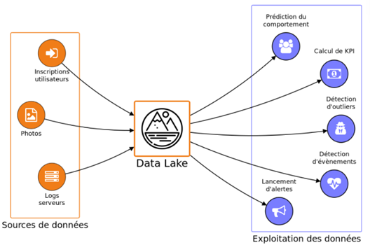

### DataMart

C'est une BDD décisionnelle moins coûteuse que l’Entrepôt de données, et plus légère puisqu’il est destiné à quelques utilisateurs d'un département. C'est une petite structure très ciblée et pilotée par les besoins des utilisateurs. Il a la même vocation que l’Entrepôt de données (il fournit une architecture décisionnelle), mais vise une problématique précise avec un nombre d'utilisateurs plus restreint. Le tableau ci-dessous donne des éléments de comparaison entre un Entrepôt de données et un Datamart :

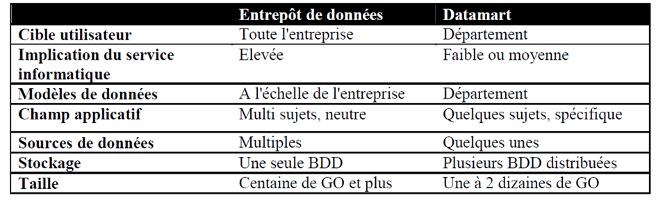

#### Mise en place

- Construire un ou plusieurs Datamarts départementaux au lieu d'un Entrepôt de données central permet de valider rapidement le concept d'informatique décisionnelle.

- Les Datamarts sont petits, moins complexes et plus faciles à déployer que les Entrepôts de données. Les différents Datamarts indépendants peuvent être dynamiquement couplés pour se métamorphoser en Entrepôt de données.

- Les Datamarts ne se résument qu'à une seule information métier (exemple : suivi d’un budget d’investissement).

### Architecture d'un système décisionnel

Tout système décisionnel est architecturé globalement de la même façon :

En amont un accès au système transactionnel en lecture seule

    - Un DataWarehouse fusionnant les données requises
    - Un ETL permettant d'alimenter le DW à partir des données existantes
    - Des applications d'exploitation de reporting, exploration et/ou prédiction
    - D'éventuels DataMart permettant de simplifier le DW en vue de certaines applications

    -Quelques exemples d'application

        - Analyse du comportement de consommateurs ou de citoyens, en fonction de leurs caractéristiques (sexe, age...), de critères socio-économiques (profession...), géographiques...

        - Analyse de ventes en fonction de l'implantation géographique de magasins (densité, caractéristiques des régions...), de l'organisation de magasins (rayonnage, marketing, RH...)

        - Analyse des structures de paniers (quel produit est vendu en même temps que quel autre à quelles conditions ?)

        - Prédiction de ventes en fonctions de données conjoncturelles, gestion des stocks, des approvisionnements

        - Contrôle qualité et analyse de défaut des chaînes de production en fonction des centres de production, des organisations, des fournisseurs...

### Principe d’un entrepôt de donnée (Datawarehouse)

Un Entrepôt de données (ou Datawarehouse) répond aux problèmes de données surabondantes et localisées sur de multiples systèmes hétérogènes, c’est une architecture capable de servir de fondation aux systèmes décisionnels. Pour être exploitables, toutes les données provenant des systèmes distribués doivent être organisées, coordonnées, intégrées et enfin stockées pour donner à l’utilisateur une vue globale des informations (voire la figure ci-dessou). Cette approche est aussi appelée « Approche d’intégration matérialisée » vu que les données extraites seront dupliquées physiquement dans l’Entrepôt.

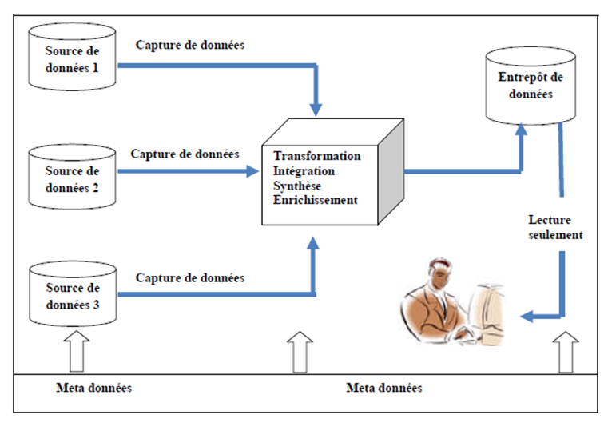

### ETL

L'ETL (Extraction Transformation Loading) est le processus de copie des données depuis les tables des systèmes transactionnels vers les tables du modèle en étoile du datawarehouse.

Exemple de modèle dimensionnel final à traiter avec l’ETL à partir d’un schéma d’une source de données :

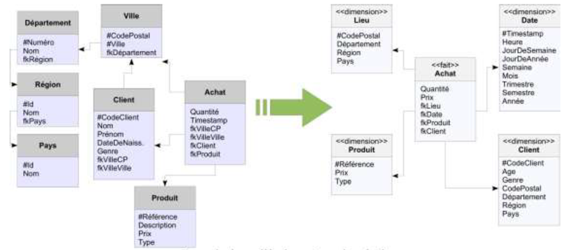

### Les zones de travail d’un ETL

Une architecture d'ETL organisée avec trois zones composées chacune d'une base de données distincte :

    - Zone d'extraction : Une base de données destinée à unifier les sources de données et offrir un point d'accès unique.

    - Zone de transformation : Une base de données destinée à traiter les sources et offrir une interface d'accès aux données transformées (API).

    - Zone d'exploitation : Une base de données destinée à implémenter le datawarehouse et les datamarts.

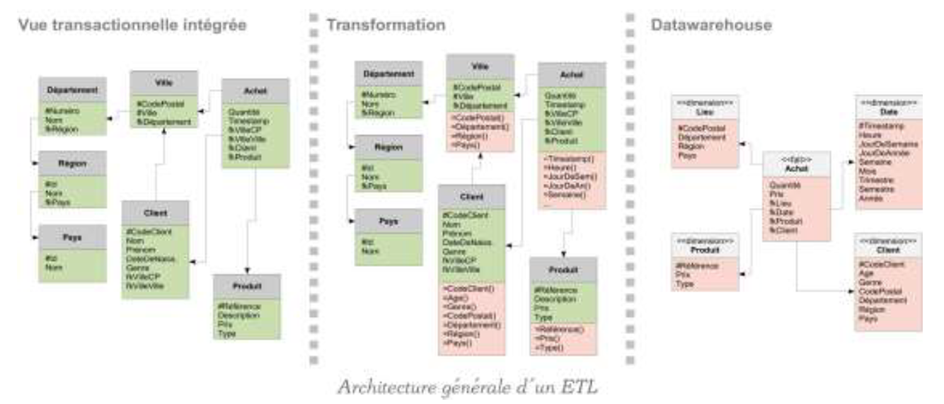

Ci-dessous le processus d’ETL en image :

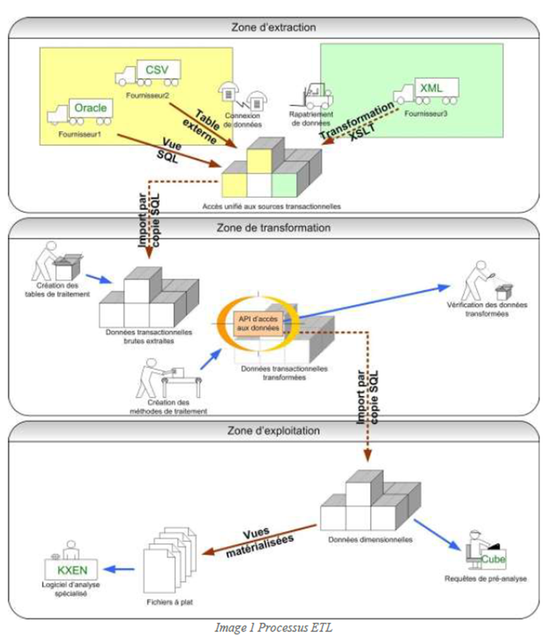

### Extraction

Il est en effet rare d’alimenter un Entrepôt de données à partir d’une unique source opérationnelle. L’ETL permet d’interconnecter un environnement technique hétérogène constitué de différentes BDD et de fichiers. Le processus d’extraction est souvent périodique. Un fichier de données est créé à des moments déterminés (exemple: quotidiennement ou mensuellement) et contient uniquement les modifications incrémentales dans les données sources (c’est-à-dire depuis l’extraction précédente). Si le système source prévoit une indication de temps, l’extraction pourra s’en servir utilement. Si non, d’autres méthodes plus complexes seront nécessaires, telles que le scannage de fichiers log ou la comparaison d’images « BEFORE » et « AFTER »

### Transformation

Une fois que les données sont extraites, elles subissent une série de traitements de manière à les rendre présentables pour les utilisateurs et dignes d’intérêt pour l’entreprise. Parmi ces transformations on trouve:

    - Le mapping (pour adapter les données à la structure cible);

    - Le calcul (pour mettre en oeuvre les règles de gestion identifiées);

    - La création d’agrégats (parfois nécessaire pour améliorer les performances);

    - La dé-normalisation et la normalisation;

    - La conversion des types de données,… etc.

### Chargement

Comme dans l’extraction, les services de chargement doivent être compatibles avec les divers environnements cibles. Le chargement doit être complet depuis la création des tables jusqu’à l’indexation.

### Analyse décisionnelle : de l’OLTP à l’OLAP

Les cubes OLAP font partie de l’arsenal des outils informatiques mis à disposition par un Système d’Information Décisionnel pour faciliter l’interrogation des données à large échelle.

Le système organisationnel ou OLTP soutient les processus métiers. A titre de rappel, les processus métiers sont les processus qui dans une entreprise, concourent directement à l’atteinte de ses objectifs. Par exemple la vente, le marketing, la manutention, etc. D’un point de vue informatique, ces processus sont soutenus à l’aide d’un OLTP (OnLine Transactionnal Processing). L’OLTP désigne l’ensemble des technologies qui sont utilisées pour automatiser ou informatiser les processus métiers. En premier plan, on pense par exemple à l’ERP. Ce système, est ainsi baptisé OLTP ou OnLine Transactionnal Processing à cause du fait qu’il gère des « transactions« , autrement dit les opérations unitaires générées par les processus métiers. C’est la gestion des transactions (ACID) qui caractérise principalement les systèmes OLTP. Quand vous lisez celà, vous ne réalisez peut-être pas les défis associés à la gestion des transactions. En effet, l’OLTP est lui-même adossé sur un SGBDR, or le SGBDR est construit sur une approche de stockage qui ne lui permet pas d’interroger les données tout en satisfaisant les 4 contraintes ACID de la gestion des transactions. C’est pourquoi un second composant est nécessaire dans le système d’information de l’entreprise, le système décisionnel ou OLAP.

Le serveur OLAP : C'est le noyau d'un système OLAP. Il effectue tout le travail, c'est le lieu où les données sont stockées. Le type de stockage des données est en fonction de l'architecture: approche MOLAP, ROLAP et HOLAP.

    - **MOLAP (Multidimensional On Line Analytical Processing)**: Ces systèmes implémentent le cube sous forme d’un tableau multidimensionnel (SGBD multidimensionnel). Chaque dimension du tableau représente une dimension du cube. On peut stocker des données de nature multidimensionnelle et fournir un temps de réponse des requêtes très rapides.

    - **ROLAP (Relational On Line Analytical Processing)**: Ces systèmes stockent les données du cube en utilisant un SGBD relationnel. Chaque dimension du cube est représentée sous forme d’une table de dimension. Chaque fait est représenté par une table de faits. Les mesures sont stockées dans les tables de faits qui contiennent les clés des tables de dimensions. Par exemple, voici un cube multidimensionnel représenté par des tables selon ROLAP :

    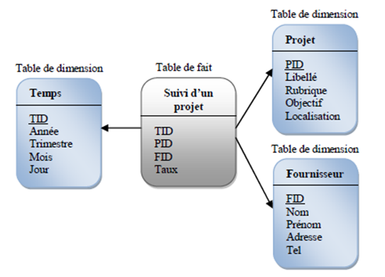

    - **HOLAP (Hybrid OLAP)** : Est une architecture hétérogène composé de tout ou partie des architectures précitées (MOLAP et ROALP). Les données sont stockées dans des tables relationnelles et les données agrégées sont stockées dans des cubes. Les requêtes vont chercher les données dans les tables et dans les cubes.

Bien que les systèmes d’informations OLTP (transactionnel/production) et OLAP aient le point commun de regrouper les données de l’entreprise dans un SGBD et d’en fournir l’accès aux utilisateurs, ils présentent de profondes différences, présentées dans le tableau ci-dessous :

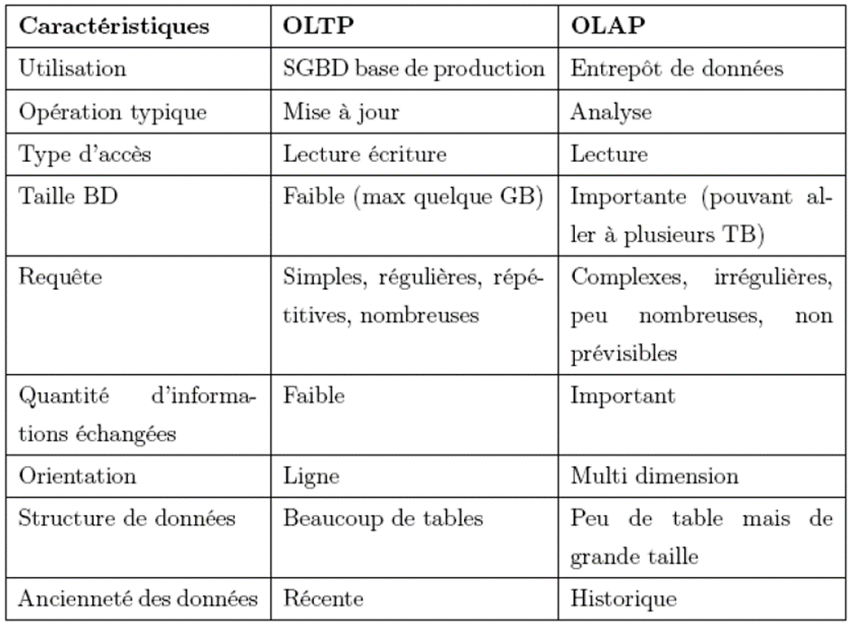

### Talend For Big Data

Le studio Talend est un environnement de développement graphique permettant les interactions avec des sources et des cibles Big Data, sans nécessité d'apprendre ou d'écrire du code. Une fois qu'une connexion Big Data est configurée, le code sous-jacent est automatiquement généré et peut être déployé en tant que service, exécutable ou Job standalone s'exécutant nativement dans votre cluster Big Data - HDFS, Pig, HCatalog, HBase, Sqoop ou Hive.

### Questions types

Donnez quelques exemples d’application pour le domaine décisionnel ?

> Analyse du comportement de consommateurs ou de citoyens, en fonction de leurs caractéristiques (sexe, age...), de critères socio-économiques (profession...), géographiques...
> Analyse de ventes en fonction de l'implantation géographique de magasins (densité, caractéristiques des régions...), de l'organisation de magasins (rayonnage, marketing, RH...)
> Analyse des structures de paniers (quel produit est vendu en même temps que quel autre à quelles conditions ?)
> Prédiction de ventes en fonctions de données conjoncturelles, gestion des stocks, des approvisionnements
> Contrôle qualité et analyse de défaut des chaînes de production en fonction des centres de production, des organisations, des fournisseurs...

- Dans quels cas on utilise l’ETL ?

>Intégration de données, migration de données, création d’un datawarehouse, vue unifiée, synchronisation…

- Quelles sont les différentes implémentations du DataMart/DataWarehouse ?

> ROLAP, MOLAP et HOLAP

- Les différents types de modèle dimensionnel ainsi que les point fort/faible de chacun ?

> voir la corbeille d'exercices

- En quoi représente la table de faits/dimension ?

> Table de faits stockant les mesures quantifiées, et les dimensions stockent les axes d’analyse

- Quel est l’objectif du model dimensionnel ?

> La modélisation par schéma en étoile, par opposition aux schémas normalisés en 3NF, permet de répondre à deux besoins caractéristiques des systèmes décisionnels : la performance et la simplicité des requêtes

- C’est quoi l’avantage du DataLake dans les applications décisionnelles ?

> Avec les datalakes, les data analyst peuvent accéder aux données, les préparer et les analyser plus rapidement et avec une plus grande précision. Pour les experts en analyse, ce vaste pool de données disponibles dans des formats non traditionnels leur donne la possibilité d'accéder aux données pour différents cas d'usage tels que l'analyse des sentiments des consommateurs ou la détection des fraudes.

- C’est quoi la différence entre l’ETL et l’ELT ?

> La différence entre l’ETL et l’ELT réside dans le fait que les données sont transformées en informations décisionnelles et dans la quantité de données conservée dans les entrepôts.

- Et le mixage des deux est -il possible ?

> Oui, des transformations peuvent être faites après le loading qui dépend principalement du type de l’application ciblée). Pourquoi ? (On traite des de données de masse, par conséquent on a besoin d’un stockage au format fichier pour plus de performance…

## Eléments de solution

### Job d’alimentation des dimensions

#### Dimensions patient

Il faudra alimenter cette dimension à travers les tables sources suivantes : Patient, Adher, Mutuelle. Puis faire les traitements nécessaires et penser à rajouter la clé de substitution qui remplacera la clé primaire pour toutes les dimensions.

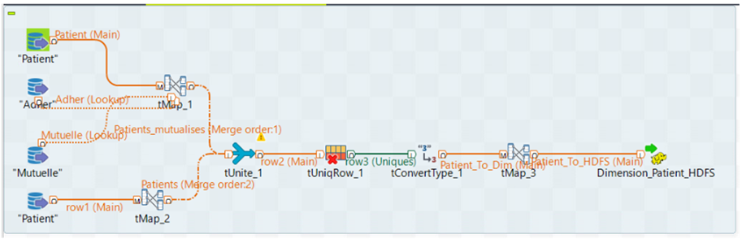

#### Dimensions diagnostic

Concernant cette dimension on aurait besoin de faire la jointure de trois tables sources « Diagnostic, Consultation et Hospitalisation ». Dans cette partie, il faut faire attention à convertir la date de consultation et celle d’hospitalisation au format année-mois-jour avant de la charger dans Hive.

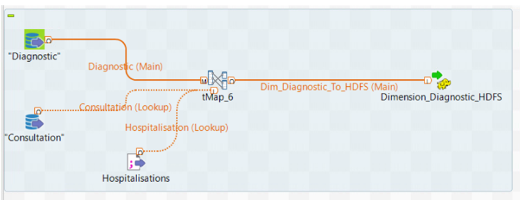

#### Dimensions localisation

Dans cette partie, on aurait besoin de deux tables. La première existe dans les données sources « Etablissements de santé » , mais pour la géolocalisation par régions et par départements ils doivent penser à la compléter soit on leur fournit la table ou bien ils la télécharge sur internet. Puis faire les jointures nécessaires pour avoir une granularité par région par département et par ville.

Remarque dans la table source «  établissement_santé » la colonne « commune » n’est pas toujours remplie lors des opérations d’écritures ou de maj. Donc ils doivent réfléchir à analyser les données des tables avant de commencer les traitements.  Dans ce cas, la fusion des deux colonnes « Cedex » et « Commune » résout le problème.

#### Dimensions professionnel

Dans cette partie, nous aurons besoin de deux tables sources «  Professionnel » et « établissement_santé »

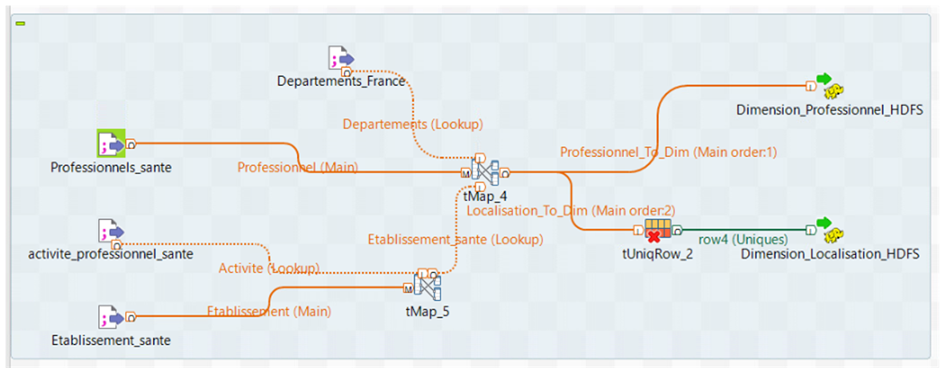

#### Dimension temps

Pour la dimension Temps, nous aurons besoin de deux tables : «  Consultation » et « Hospitalisation » afin de récupérer les dates concernées par les mesures dans la table des faits, puis faire les traitements nécessaires : fusion des deux dates, supression des doublons, … et faire les conversions pour avoir au final une granularité par Années/Mois/Jour. Remarque en utilisant la fonction FormatDate le type engendré sera de type « String »  et non pas « Intiger ». Faire de même pour les dates pour la satisfaction (par année) et pour les décès.

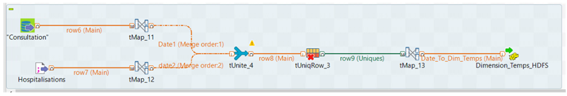

### Chargement de données dans le datalake

Une fois que les scénarios sont faits, le chargement se fait dans HDFS, sous format TXT, et ils doivent créer un dossier pour chaque dimension qui contiendra l’ensemble des données de la dimension.

### Alimentation des tables physique sous hive

Il faut au préalable créer une BDD puis les tables logiques dans Hive, en y ajoutant l’option de table externe ainsi que le chemin des données dans HDFS. Mais s’ils veulent charger les données dans Hive en créant une table interne ils vont faire un LOAD depuis le Datalake dans HDFS, sachant que les données seront supprimées une fois que le chargement sera fait.

### Job d’alimentation des mesures

Nous aurons besoin dans cette partie pour récupérer l’ensemble des clés de substitution des tables de dimension ainsi que quelques données calculées sur les mesures dans la table des faits comme le nombre de consultations par jour, … afin de faciliter par la suite du traitement des mesures dans le cube.

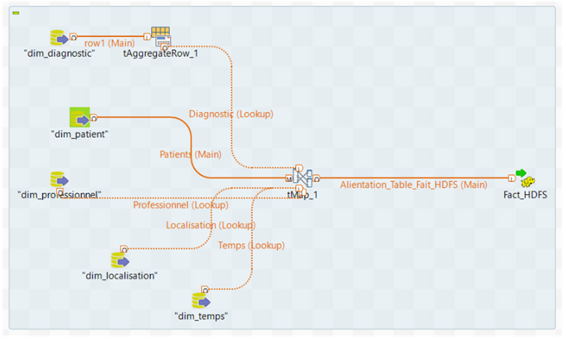