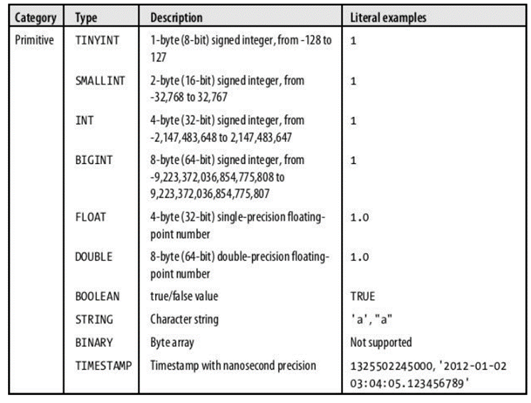
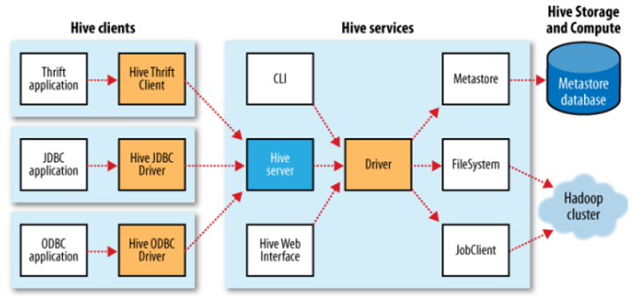

# Prosit 3 - Prosit Retour

## Définitions

### Rappel des propriétés ACID

Pour mettre en rapport les problématiques de la base de données relationnelle, on parle de propriétés ACID pour les transactions (séquences d'opérations/requêtes) :

    - Atomicité : Une transaction s’effectue entièrement ou pas du tout

    - Cohérence : Le contenu d’une base doit être cohérent au début et à la fin d’une transaction

    - Isolation : Les modifications d’une transaction ne sont visibles/modifiables que quand celle-ci a été validée

    - Durabilité : Une fois la transaction validée, l’état de la base est permanent (non affecté par les pannes ou autre)

Toutefois, ces propriétés ne sont pas applicables dans un contexte distribué tel que le NoSQL.

Ainsi, les propriétés BASE ont été proposées pour caractériser les bases NoSQL :

    - Basically Available : quelle que soit la charge de la base de données (données/requêtes), le système garantie un taux de disponibilité de la donnée

    - Soft-state : La base peut changer lors des mises à jour ou lors d'ajout/suppression de serveurs. La base NoSQL n'a pas à être cohérente à tout instant

    - Eventually consistent : À terme, la base atteindra un état cohérent

### Théorème de Brewer dit "théorème de CAP"

En 2000, Eric A. Brewer a formalisé un théorème très intéressant reposant sur 3 propriétés fondamentales pour caractériser les bases de données (relationnelles, NoSQL et autres) :

    - Consistency (Cohérence) : Une donnée n'a qu'un seul état visible quel que soit le nombre de réplicas

    - Availability (Disponibilité) : Tant que le système tourne (distribué ou non), la donnée doit être disponible

    - Partition Tolerance (Distribution) : Quel que soit le nombre de serveurs, toute requête doit fournir un résultat correct

Le théorème de CAP dit : « Dans toute base de données, vous ne pouvez respecter au plus que 2 propriétés parmi la cohérence, la disponibilité et la distribution ».

### NoSQL

Le terme NoSQL désigne un type de systèmes de gestion de base de données qui va au-delà des systèmes relationnels associés au langage SQL en acceptant des structures de données plus complexes. Selon leurs modèles physiques, les BD gérées par ces systèmes se répartissent en quatre catégories : colonnes, documents, graphes et clé-valeur. Chacune d’elles offrant des fonctionnalités spécifiques.

Le choix de la catégorie du SGBD la plus adaptée à une application donnée, est lié à la nature des traitements (les requêtes) appliqués sur les données. Mais ce choix n’est pas exclusif puisque, dans chaque catégorie, les SGBD peuvent assurer tous les types de traitements, au prix parfois d’une certaine lourdeur ou d’une programmation plus importante.

#### Modèle orienté colonne

Le modèle orienté-colonnes est un modèle structuré où les données sont organisées en familles de colonnes, ce qui équivaut au concept de table dans le modèle relationnel. Les lignes possèdent un identifiant appelé clé de ligne et sont composées d’un ensemble de valeurs ; chacune est associée à une colonne. Ainsi, la recherche d’une valeur revient à parcourir la séquence : clé de ligne -> famille de colonnes -> colonne. Exemple HBASE, CASSANDRA et ACCUMULO.

#### Modèle orienté-documents

Les données dans un modèle orienté-documents sont organisées en collections de documents. Un document est identifié par une clé à laquelle correspond un agrégat de couples clé-valeur qui peuvent être hiérarchisés. Cela veut dire que la valeur peut-elle même contenir une ou plusieurs paires clé-valeur.

Au sein de la même collection, les documents peuvent être de structures différentes (voir figure suivante). Autrement dit, les couples utilisés pour définir les documents d’une collection ne sont pas forcément les mêmes. De plus, comme les autres modèles NoSQL, le modèle orienté-documents est flexible ; on peut ajouter des couples à chaque insertion d’un nouveau document.

#### Modèle orienté-graphes

Ce modèle organise les données sous forme de noeuds et de relations. Les noeuds et les arcs (c’est-à-dire les relations) peuvent porter un ensemble de propriétés exprimées sous la forme de paires clé-valeur (cf. figure ci-dessous). Ce modèle est utile pour stocker et interroger des données complexes fortement liées ; c’est le cas par exemple des données issues des réseaux sociaux.

#### Modèle orienté clé-valeur

Il s’agit du modèle NoSQL le plus basique et qui a été le précurseur dans les SGBD NoSQL. Il organise les données sous forme de paires clé-valeur (cf. figure suivante), où la clé est le point d’entrée unique qui permet d’accéder à la donnée. Les modèles de données orientés colonnes, documents et graphes présentés précédemment sont des évolutions du modèle clé-valeur.

### Hive

Hive est un outil d'entrepôt de données construit sur Hadoop. Il fournit un langage de type SQL pour interroger les données. Nous pouvons exécuter presque toutes les requêtes SQL dans Hive, à la seule différence que cela exécute un travail de réduction de carte au niveau du serveur principal pour récupérer le résultat du cluster Hadoop.

Les principales caractéristiques de Hive : Hive se distingue d’une base de données traditionnelle par les caractéristiques suivantes:

- Il supporte les bases de données traditionnelles en soutenant le SQL, mais ne constitue pas une base de données complète.

- Dans un SGBDR, le schéma d’une table est appliqué au moment de la charge, si les données en cours du chargement ne sont pas conformes au schéma, elles sont rejetées, cette conception est appelée schéma en écriture. Mais Hive ne vérifie pas les données lors du chargement mais lors de la récupération, cette conception est appelée schéma en lecture. L’opération de chargement des données dans Hive est juste une copie de fichier ou un déplacement.

- Il est basé sur la notation de Write Once Read Many. Il est donc possible d’écrire qu’une seule fois (Write Once) et de lire autant de fois souhaité (Read Many)

- Il n’autorise pas les opérations : insertions, suppressions et modification, car Hive est construit pour fonctionner sur des données HDFS utilisant MapReduce, où l’analyse et la mise à jour des données s’obtenaient en transformant les données en une nouvelle table.

- Il ne prend pas en charge les traitements de transaction en ligne OLTP (Online Transaction Processing) car Hadoop est un système orienté par lots.

### HiveQL

Le langage HiveQL supporte la définition de données (DDL) dans la création des tables avec des formats de sérialisation spécifiques, de partitionnement et de buckting. Et ne supporte guère la mise à jour et la suppression de lignes des tables existantes. Il soutient l’insertion multi-table, où les utilisateurs peuvent exécuter plusieurs requêtes sur les mêmes données d’entrée en utilisant une seule déclaration Hive, ce qui optimise l’exécution des requêtes. HiveQL est un langage extensible car il permet aux utilisateurs de créer leur propre fonction avec le langage Java, également de définir les fonctions d’agrégation et les fonctions de table génératrices.

### Types de données

Les types de données de Hive sont de deux types soit primitifs ou complexes. Les types primitifs illustrés dans FIG ci-dessous correspondent aux types de données du langage Java, Mise à part le type STRING qui est l’équivalent du type VARCHAR du langage SQL. Les types Complexes (illustrés ci-après) sont de type : STRUCT qui est un enregistrement encapsulant un ensemble de champs, ainsi que des deux types ARRAY et MAP semblables à leurs homonymes en langage Java/

#### Types de données primitifs de HiveQL



#### Types de données complexes


### Architecture de Hive

La figure ci-après illustre les principales composantes de Hive et leurs interactions avec Hadoop. Ces composantes seront détaillées dans les points suivants :


- Thrift Server : Expose une API permettant l’exécution des commandes HQL. Les clients se connectent au serveur Hive en utilisant le JDBC driver, ODBC driver ou Thrift client, expliqué ci-dessous dans la section Hive clients.

- Driver : Invoque le compilateur de Hive lors de la réception d’une requête HiveQL. Le compilateur traduit ensuite cette requête dans un plan qui consiste en un ensemble de tâches map et reduce.

- Hive services : Désigne les nombreux services qu’un utilisateur peut exécuter sous Hive. Avec la commande "–service", un utilisateur peut spécifier le service à exécuter. Parmi ces services disponibles :

        - CLI : l’interface de ligne de commande de Hive (le shell). C’est le service par défaut.

        - Hive server : son exécution permet aux applications utilisant le Thrift, JDBC, et les connecteurs ODBC de communiquer avec Hive.

        - HWI : est l’interface Web de Hive qui est une alternative au shell de Hive.

        - Jar : représente un moyen pratique pour exécuter les applications Java qui inclut les classes Hadoop et Hive à la fois sur le classpath.

- Hive clients : L’accès aux services de Hive se fait via les différents types des clients Hive cités ci-dessous. La FIG ci-après illustre la relation entre les clients et les services de Hive.



        - Hive thrift client : Facilite l’exécution des commandes Hive à partir d’un large ensemble de langage de programmation. Le client thrift est écrit en plusieurs langages : C++, Java, PHP, Python et Ruby.

        - JDBC driver : Hive fournit un pilote JDBC (Java DataBase Connectivity) de type 4, défini dans la classe org.apache.hadoop.hive.Jdbc.HiveDriver. , qui permet à une application Java de se connecter à un serveur Hive en cours d’exécution.

        - ODBC driver : Le pilote ODBC de Hive permet aux applications qui prennent en charge le protocole ODBC de se connecter à Hive. Le pilote ODBC ou JDBC utilise tous les deux le Client thrift pour communiquer avec le serveur Hive.

- Metastore : Contient la description des bases de données, des tables, des partitions et des colonnes. Le Metastore est le référentiel central des métadonnées de Hive. Ces derniers sont accessibles via l’API du service Metastore. Par défaut, le Metastore utilise une base de données Debry intégré dans le service Hive. Ceci est appelé la configuration en mode embarqué (Embedded metastore) tel illustré dans la FIG ci-après, ci-dessous. Le mode embarqué est seulement adapté pour les tests et le développement local, dans le cas contraire, un serveur MySQL peut être utilisé. Configuration de metastore de Hive en mode embarqué :

- Les bases de données sous Hive : Une base de données dans Hive se présente tel un catalogue ou un espace de tables. La création d’une base de données implique la création d’un répertoire à l’emplacement spécifié par la propriété "hive.metastore.warehouse.dir". Ce répertoire se compose d’un ensemble de sous répertoires associés à chaque table de la base. Dans le cas de la non spécification d’une base de données, Hive désigne la base de données par défaut. La suppression d’une base de données dans Hive s’effectue seulement après la suppression de toutes les tables ou en ajoutent le mot clé CASCADE à la syntaxe de suppression de la base.

- Les tables Hive : Une table Hive est constituée des données stockées et les métadonnées associées décrivant l’agencement des données de la table. Les données sont stockées généralement dans HDFS, comme elles peuvent résider dans un répertoire externe spécifié lors de la création des tables. Lors de la création d’une table, Hive ajoute deux propriétés à celle-ci. La propriété last_modified_by qui contient le dernier utilisateur qui a modifié la table. Et la propriété last_modified_time qui contient le moment de la la dernière modification. Dans Hive, il y a deux types de tables :

        - Les tables internes : aussi appelées managed qui sont des tables dont le cycle de vie de leurs données est contrôlé par Hive. L’entrepôt Hive stocke les données des tables internes dans un sous-répertoire du répertoire défini par hive.metastore.warehouse.dir, par défaut.

        - Les tables externes : est une table dont les données sont stockées en dehors de l’entrepôt Hive. La création et la suppression des données sont contrôlées par l’utilisateur, en spécifiant l’emplacement des données pendant la création. Généralement les tables externes sont utilisées pour accéder à un ensemble de données initialement stocké dans HDFS par un autre. Comme elles peuvent être utilisées pour exporter les données pour un processus tiers

- Format de stockage dans Hive : Il y a deux dimensions qui régissent le stockage de la table dans Hive, le format de la ligne et le format de fichier :

        - Le format de ligne : est défini par SerDe(Sérialiseur/Désérialiseur). Un désérialiseur c’est dans le cas de l’interrogation d’une table, un SerDe sera désérialisé une ligne de données à partir des octets dans le fichier d’objets utilisés en interne par Hive. Lorsqu’il est un sérialiseur, dans le cas de l’exécution d’une instruction INSERT ou CTAS, SerDe de la table sera sérialisé représentation interne d’Hive d’une ligne de données dans les octets qui sont écrits dans le fichier de sortie.

        - Le format de fichier : détermine le format de conteneur pour les champs dans une rangée. Le format le plus simple est un simple fichier texte, mais il y a des formats binaires en colonnes ligne orientée.

### Partitionnement

Lors du partitionnement sous Hive,les tables sont divisées en plusieurs partitions. Chaque partition est stockée dans un sous répertoire du répertoire de la table partionnée. Le partitionnement s’effectue selon la valeur du champ spécifié par l’utilisateur avec la clause PARTITIONED BY <valeur_champ>, et une partition peut être sous partitionnée

### Bucket

Les données sont organisées en fichiers séparés selon la valeur du hashé calculé à partir de la valeur du champ bucket définie par l’utilisateur. Les tables ou les partitions peuvent être bucketed en utilisant CLUSTERED BY et les données peuvent être stockées dans ses buckets via SORT BY [27]. Il y a deux raisons principales pour lesquelles les tables sont organisées avec des Buckets, qui sont :

    - Efficacité des requêtes : le Bucketing impose une structure supplémentaire sur la table. La jointure de deux tables est plus efficace si la jointure se fait sur une colonne " bucketée " de part et d’autre.

    - Efficacité d’échantillonnage : lorsqu’on travaille avec un grand ensemble de données, il est très pratique de tester la requête sur une fraction de l’ensemble de pendant la phase de développement

### Apache Hive : avantages

Apache Hive est une solution idéale pour les requêtes had-hoc et les analyses de données. Elle permet donc d’obtenir des insights procurant un avantage compétitif et facilitant la réaction face à la demande du marché.

Parmi les principaux avantages de Hive, on peut citer la simplicité d’utilisation liée à son langage » SQL-like « . En outre, ce logiciel accélère l’insertion initiale de données puisque les données n’ont pas besoin d’être lues et numérotées sur un disque dans le format interne de la base de données. En effet Apache Hive lit le schéma sans vérifier le type de tableau ou la définition du schéma alors qu’une base de données traditionnelle doit vérifier les données chaque fois qu’elles sont insérées.

Sachant que les données sont stockées dans le HDFS, il est possible de stocker des centaines de petabytes de données sur Apache Hive. De fait, cette solution est bien plus scalable qu’une base de données traditionnelle. Sachant qu’il s’agit d’un service Cloud,Hive permet aux utilisateurs de lancer rapidement des serveurs virtuels en fonction des fluctuations de workloads.

La sécurité est au rendez-vous, avec la possibilité de répliquer les workloads critiques pour la restauration en cas de désastre. Enfin, la capacité de travail est hors pair puisqu’il est possible d’effectuer jusqu’à 100 000 requêtes par heure

### Les limites de Hive

- Toutes les requêtes standard ANSI SQL ne sont pas prises en charge par le langage de requête Hive (HiveQL).

- Le langage Hive ne supporte pas l’insertion au niveau des lignes, la mise à jour et la suppression.

- Après la création de la table, le type de colonne ne peut être modifié.

- Le temps de latence des requêtes Hive est plus élevé que celle d’une base de données traditionnelle.

- Hive ne fournit pas les transactions. Il ne peut être utilisé dans l’OLTP. Pour cela une base de données NoSQL doit lui être associée.

### Vues dans Hive

Apache Hive optimise les requêtes à l'aide des vues matérialisées que vous créez. À l'aide d'une vue matérialisée, l'optimiseur peut comparer les anciennes et les nouvelles tables, réécrire les requêtes pour accélérer le traitement et gérer la maintenance de la vue matérialisée lors des mises à jour des données. L'optimiseur peut utiliser une vue matérialisée pour réécrire entièrement ou partiellement les projections, les filtres, les jointures et les agrégations. Hive stocke les vues matérialisées dans l'entrepôt Hive ou le druide.

Agrégats dans Hive : Un agrégat est obtenu en effectuant une opération (somme, maximum, minimum, le compte…etc.) de plusieurs données détaillées. Le pré-calcul et le stockage du résultat de l’agrégation permettent d’améliorer la rapidité du traitement des requêtes dans hive.

## Eléments de solution

Pour la solution de ce livrable, il faut contrôler que chaque groupe a bien créé les tables de dimensions ainsi que la table de faits dans Hive. De préférence des tables de type externe.

### Etape 1 : Création de tables de dimensions du projet dans Hive

```sql
    CREATE EXTERNAL TABLE IF NOT EXISTS Dim_patient (Sk_patient INT, Id_patient INT, Nom STRING, Prenom STRING, Sexe STRING, Age INT, Poids FLOAT, Taille FLOAT, Mutuelle STRING)
    COMMENT 'Axe d’analyse patients'
    ROW FORMAT DELIMITED
    FIELDS TERMINATED BY ';'
    STORED AS TEXTFILE
    LOCATION '/user/cloudera/sources/patients';

    CREATE EXTERNAL TABLE IF NOT EXISTS Dim_professionnel (Sk_professionnel INT, Id_professionnel INT, Nom STRING, Prenom STRING, Profession STRING, Specialite STRING, Nom_etablissement STRING, Commune STRING)
    COMMENT 'Axe d’analyse professionnel'
    ROW FORMAT DELIMITED
    FIELDS TERMINATED BY ';'
    STORED AS TEXTFILE
    LOCATION '/user/cloudera/sources/professionnels';

    CREATE EXTERNAL TABLE IF NOT EXISTS Dim_localisation (Sk_localisation int, Pays STRING,Region STRING, Departement STRING, Commune string)
    COMMENT 'Axe d’analyse par localisation'
    ROW FORMAT DELIMITED
    FIELDS TERMINATED BY ';'
    STORED AS TEXTFILE
    LOCATION '/user/cloudera/sources/localisations';

    CREATE EXTERNAL TABLE IF NOT EXISTS Dim_diagnostic (Sk_diagnostic INT, Id_patient INT, Id_professionnel STRING, diagnostic STRING, motif STRING, Date_consultation DATE, Date_hospitalisation DATE)
    COMMENT 'Axe d’analyse par diagnostic'
    ROW FORMAT DELIMITED
    FIELDS TERMINATED BY ';'
    STORED AS TEXTFILE
    LOCATION '/user/cloudera/sources/diagnostics';

    CREATE EXTERNAL TABLE IF NOT EXISTS Dim_temps (Sk_temps int, Dates date, Annee string, Mois string, Jour string)
    COMMENT 'Axe d analyse par periode'
    ROW FORMAT DELIMITED
    FIELDS TERMINATED BY ';'
    STORED AS TEXTFILE
    LOCATION '/user/cloudera/sources/temps';
```

### Etape 2

Juste après avoir créé les dimensions, il faut créer la table des faits :

```sql
    CREATE EXTERNAL TABLE IF NOT EXISTS Facts (Sk_patient INT , Sk_professionnel INT, Sk_localisation int, Sk_diagnostic int, Sk_temps int, nbre_consultation float, nbre_hospitalisatio float, nbre_deces float, taux_satisfaction float)
    COMMENT 'Mersures'
    ROW FORMAT DELIMITED
    FIELDS TERMINATED BY ';'
    STORED AS TEXTFILE
    LOCATION '/user/cloudera/sources/faits';
```

### Etape 3

Peuplement des tables de dimension : à partir des dossiers (/patient, /professionnel, /…) à partir du datalake, importer dans la clause location.

### Etape 4

Peuplement de la table de faits : Il faut s’assurer que les tables dimensions sont toutes peuplées pour charger les clés étrangères dans la table de faits. Ici il faut utiliser les vues pour les jointures entre les dimensions et la mesure.

### Etape 5

Création des agrégats (cube) dans la tables de faits : vous pouvez utilisé les composants TAggregate dans Talend pour calculer les mesures, ou bien le réaliser avec le HiveQL et insérer le résultat dans la table de faits

### Etape 6

Création des partitions et des buckets : ici selon les besoins exprimés par les décideurs, il faut partitionner la table de faits ainsi que les dimensions pour répondre rapidement aux analyses en terme de performance.

- Ex. partitionner la table patient en fonction du sexe, tranche d’âge.
- Ex. partitionner la table professionnel en fonction de l’établissement
- Ex. partitionner la table localisation en fonction de la région.
- Ex. partitionner la table temps en fonction de l’années (entre 2015 et 2021)
- Ex. partitionner la table de faits par rapport à la granularité choisi des mesures stockées (par jour, par mois, par ville, par établissement…)

Pensez à créer des buckets en fonction des besoins d’analyse dans chacune des partitions.

### Etape 7

Repondre aux besoins des décideurs (décris dans la section analyse des besoins) à travers des requêtes HiveQL (voir le ws) sans le partitionnement.