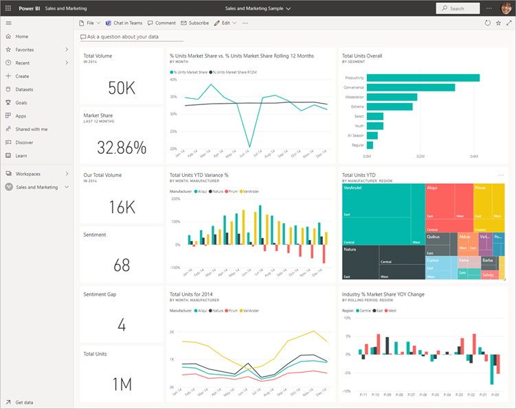
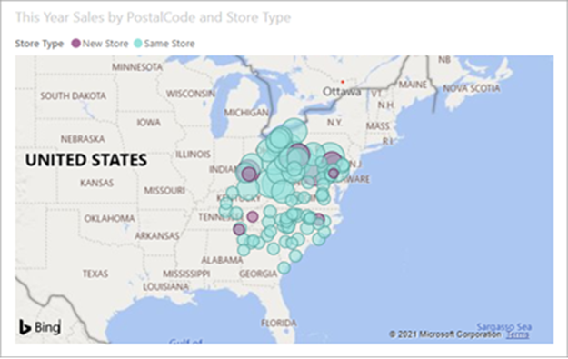
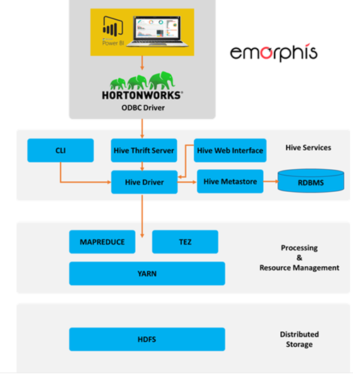

# Prosit 4 - Prosit Retour

## Définitions

### KPI

Les indicateurs clés de performance (Key Performance Indicators, KPI) sont utiles pour mesurer les performances en matière de BI et d’analytique. Mais ils posent les problèmes de la définition et de la mesure des performances dans le cadre d’objectifs métier. Il faut donc savoir utiliser des « connaissances exploitables » pour générer de la valeur à partir d’un système d’informatique décisionnelle efficace.

### Tableau de bord Power BI

C'est une page, souvent appelée canevas, qui utilise des visualisations pour raconter une histoire. Comme il est limité à une seule page, un tableau de bord bien conçu contient uniquement les éléments les plus importantes de cette histoire.

### Rapport

Un rapport Power BI est un affichage sous plusieurs angles d’un jeu de données, avec des visuels représentant différents résultats et insights de ce jeu de données. Un rapport peut avoir un seul visuel ou des pages entières de visuels. Selon votre fonction principale, vous pouvez soit concevoir des rapports, Vous pouvez également être un utilisateur métier qui consomme ou utilise des rapports.

### Storytelling

Le Data Storytelling est l’art de raconter une histoire à un auditoire à travers une collection de données. L’objectif de cette pratique est de faciliter la compréhension des résultats d’analyses de données par un public précis.

#### Exemple de data Storytelling

Imaginons que nous sommes une entreprise de commerce en ligne, et nous avons recueilli une grande quantité de données sur nos clients et leurs habitudes d'achat au cours des dernières années. L'objectif est d'améliorer les ventes et la satisfaction client. Voici un exemple de data storytelling basé sur ces données.

---

**Titre :** Augmenter la fidélisation des clients grâce à l'analyse des données d'achat

**Introduction :**  
En examinant les données des trois dernières années, nous avons identifié des tendances clés qui influencent les décisions d'achat de nos clients. Notre objectif aujourd'hui est de partager ces découvertes et de proposer des stratégies pour améliorer l'engagement et la fidélisation des clients.

**Histoire :**  
Nous avons commencé par segmenter notre base de clients selon la fréquence d'achat et le volume dépensé. Trois segments principaux ont émergé : les acheteurs occasionnels, les réguliers, et les fidèles. En analysant les périodes d'achat, les catégories de produits, et les feedbacks clients, nous avons remarqué que les acheteurs fidèles sont particulièrement sensibles à nos campagnes de marketing ciblé et aux promotions personnalisées.

**Découverte clé :**  
Une analyse approfondie a révélé que près de 40% des acheteurs occasionnels ne reviennent pas après leur premier achat. En creusant ces données, nous avons découvert que ces clients ont souvent rencontré des problèmes avec le temps de livraison ou la qualité du produit. Cependant, ceux qui ont contacté notre service client ont eu 50% plus de chances de faire un second achat.

**Visualisation :**  
[Un tableau de bord interactif montre le taux de rétention des clients avec et sans interaction avec le service client, mettant en évidence l'impact positif du support après-vente sur la fidélisation des clients.]

**Action proposée :**  
Pour transformer les acheteurs occasionnels en clients réguliers, nous proposons d'améliorer notre logistique de livraison et de renforcer notre service après-vente. En outre, une campagne de réengagement personnalisée sera lancée, ciblant les clients qui n'ont pas effectué de deuxième achat.

**Conclusion :**  
Grâce à l'analyse des données, nous avons non seulement identifié un point critique dans notre processus de fidélisation des clients mais aussi formulé une stratégie concrète pour améliorer notre service et augmenter nos ventes. Les prochains mois seront consacrés à l'implémentation de ces améliorations et au suivi continu des résultats via notre tableau de bord.

---

Microsoft Power Query procure une expérience d’importation de données puissante qui englobe de nombreuses fonctionnalités. Power Query fonctionne avec les classeurs Analysis Services, Excel et Power BI. Une fonctionnalité principale de Power Query consiste à filtrer et à combiner, autrement dit, à hybrider des données issues d’une ou de plusieurs des nombreuses sources de données prises en charge. Tout mashup de données de ce type est exprimé à l’aide du langage de formules Power Query M. Il s’agit d’un langage fonctionnel, sensible à la casse, similaire à F#.

Le Data Storytelling est traduit très justement par l’Office Québécois de la Langue Française, par Mise en Récit des Données. Il s’agit d’une nouvelle brique d’un système décisionnel, apparu au début des années 2010. Parmi les premiers éditeurs de logiciel promoteurs de cette méthode, Tableau, Microsoft (avec PowerView) ou encore Yellowfin (un éditeur australien de logiciels de Business Intelligence), peu connu mais sans doute celui qui a le mieux intégré un logiciel de présentation dans son outil de Business Intelligence. Les fonctions de requête et d’analyse sont au coeur des outils décisionnels depuis les années 80. Avec les années 2000 et les outils de BI agile, les capacités de visualisation graphique se sont largement améliorées, et mises à la portée de l’utilisateur final, grâce à des outils comme Qlik, Tableau, Spotfire ou plus tard Power BI de Microsoft. Mais une fois les graphiques préparés, quel dommage de simplement les « coller » dans une présentation figée. Et surtout comment les organiser, comment raconter une histoire lors de la construction de la présentation. Cette mise en récit des données, c’est l’ajout de la narration aux fonctions de création graphique. Sans un module d’aide à la conception narrative, aucun outil ne devrait utiliser le terme de Data Storytelling.

### Restitution

c’est la dernière étape d’un projet d’entreposage de données, soit son exploitation. L’exploitation de l’entrepôt se fait par le biais d’un ensemble d’outils analytiques développés autour de ce dernier. Il s’agit de regrouper tout ce qui a attrait à la représentation et la transmission des résultats d’analyse de données. Le principe de la restitution, donc, est d’agréger et de synthétiser des données nombreuses et complexes sous forme d’indicateurs, de tableaux, de graphiques permettant d’en avoir une appréhension globale et simplifiée pour faire toutes les analyses nécessaires.

### Visualisation

La visulation est la représentation graphique ou visuelle des informations/indicateurs du tableau de bord. Grâce à des éléments visuels tels que les histogrammes, les boîtes à moustache, les graphiques croisés, ou encore les cartes géographiques, une visualisation de données permet de rapidement comprendre l’état des activités de l’entreprise et surtout de d’identifier facilement des tendances inhabituelles. Exemple de visualisation dans power BI : carte simple

### Expérience utilisateurs dans un projet BI

Issue des sciences humaines et de la démarche ergonomique (la découverte d’un support interactif induit une certaine part d’inconnu), la pratique de l’expérience utilisateur a pour objectif de déterminer la satisfaction liée à l’utilisation de fonctions d’une part et la manière de les faire évoluer tant sur la forme (réponse fonctionnelle à une promesse) ; sur le fond (la fonction ou le service en soit, son nom, description et promesse) que sur la manière d’y accéder (visibilité, accessibilité); ainsi que sur l’impact de notoriété du diffuseur du support.

Depuis qu’il est prouvé que la satisfaction utilisateur est aussi bien liée à la capacité de commercialisation du produit/service comme à la perception de la marque par l’utilisateur; le terme fait actuellement référence à des notions essentielles de la communication, du design et du marketing relationnel. Il n’est donc plus uniquement basé sur des critères ergonomiques et s’utilise principalement dans le cadre du design numérique (digital).

### DAX

DAX est une collection de fonctions, d’opérateurs et de constantes qui peuvent être utilisés dans une formule, ou une expression, pour calculer et retourner une ou plusieurs valeurs. En termes simples, DAX vous aide à créer des informations à partir des données déjà présentes dans votre modèle.

### DataVIZ pour le big data

Elle permet une compréhension et une analyse rapide de données souvent complexes et surtout immenses. Ainsi, l’expérience utilisateur est optimisée et facilite largement les prises de décisions. Cloudera propose des connectiques pour Power BI pour analyser les données de Hive. Le schéma de l’architecture de connexion entre power BI et Hive est représenté ci-dessous 

 
## Questions de validation

- Quels sont les types de visualisations dans Power BI ?

-Différence entre Tableau de bord, visualisation et rapports ? (voir PR)

-Pourquoi faire intervenir l’expérience utilisateur dans un projet dataViz (décisionnel) ?

> Consolider les résultats

- Quels sont les types de contenus disponibles dans Power BI ?

> Rapports analytiques, interactifs
> Rapports paginés, opérationnels, préconçus pour des filtres, des grands tableaux formatés, pouvant être imprimés en pdf
> Dashboard : épingler des visuels de plusieurs visuels au sein d’une même vue
> Fichiers Excel
> Insight : info d’un jeu de données que l’on peut épingler sur un tableau de bord

- Le requetage est possible dans power BI ?

> Oui, possible des faire des scripts dans power BI

- Quel est le langage utilisé pour définir les mesures ?

> DAX

- Comment se fait la connexion à une base de données Hive / HDFS ?

> Driver ODBC

## Eléments de solutions

### INCITER LES UTILISATEURS À ÉVALUER LEURS BESOINS

Il est possible de collecter des KPI pour élaborer le tableau de bord conceptuel d’une entreprise et de les associer à différentes activités métier, en particulier dans nos quatre domaines de création de valeur que sont la valeur financière, la productivité, le risque et la confiance. La BI offre un autre intérêt conceptuel ; elle permet de capturer les définitions métier des KPI, de gérer ces définitions en les intégrant à la base de connaissances de l’entreprise puis de générer un tableau de bord pour rendre compte de ces mesures.

### BIEN CHOISIR SON OUTIL DÉCISIONNEL ? COMMENCEZ PAR BIEN COMPRENDRE LES BESOINS DE VOS MÉTIERS

Sources de données. Vos utilisateurs utiliseront-ils des jeux de données prédéfinis, par exemple ceux d’une application métier ou d’un entrepôt de données spécifique, ou détermineront-ils les données utiles au fil de leur analyse ?

Mesures de performances. Les mesures de performances de votre entreprise, également appelées indicateurs clés de performance ou indicateurs métier, sont-elles déjà définies et acceptées, ou vos utilisateurs professionnels

Analyse périodique ou unique. Vos utilisateurs professionnels ont-ils besoin d’un instantané périodique des performances opérationnelles (quotidien, hebdomadaire, mensuel ou trimestriel) ou l’analyse sera-t-elle effectuée une seule fois ?

DataViz. Vos utilisateurs professionnels préfèrent-ils des rapports sous forme de tableaux, des graphiques d’activité élémentaires tels que les histogrammes, les courbes ou les graphiques sectoriels, ou des représentations plus évoluées comme les cartes thermiques, les graphiques en nuage de points et les cartes géo-spatiales ?

Utilisation des feuilles de calcul. Les feuilles de calcul sont-elles souvent utilisées pour l’analyse et le seront-elles encore à l’avenir ? Les feuilles de calcul servent-elles souvent à intégrer des données de différentes sources, à appliquer des règles métier évoluées ou à effectuer des calculs pointus ?

Connaissance métier des données. Vos utilisateurs professionnels ont-ils une bonne connaissance des données ? Savent-ils comment les différentes sources de données sont connectées ? Et comprennent-ils les anomalies, telles que les problèmes de qualité et les lacunes de données ?

Compétences analytiques métier.  Quel est le niveau de compétence de vos utilisateurs professionnels en matière d’analyse de données ? Les utilisateurs les plus chevronnés auront une très bonne connaissance de différentes techniques d’analyse et éventuellement des compétences en statistiques, tandis que les moins expérimentés s’appuieront sur une analyse guidée limitée aux fonctions de filtre et d’exploration

### Répondre aux questions d’analyses identifiées dans l’étape 1

L’exploitation de l’entrepôt Hive se fait aussi par le biais d’un ensemble d’outils analytiques Ici le choix se porte sur l’outil de data visualisation et de Dashboard de Microsoft « Power BI Desktop » :

    - Installer et configurer le pilote ODBC « ClouderaHiveODBC64 » pour pouvoir se connecter à Hive_Cloudera.

    - Accéder aux dossier de datalake : /user/hive/… afin de récupérer les données qui répondent aux besoins identifiés

    - Identifier les graphes qui répondent aux questions des décideurs : pourquoi et comment ?

    - Identifier les visuels pertinents pour analyser les indicateurs sur le suivi des patients ainsi que la répartition des axes. Exemple de graphe de répartition de l’axe diagnostic ci-dessous :.

    - Faire les traitements nécessaires pour générer les agrégations des indicateurs (nombre de consultation, nombre d’hospitalisation, taux de satisfactions et nombre de décès) avec le langage DAX.

    - Chargement du schéma en étoile et des données dans Power BI

    - Télécharger et épingler les visualisations dans vos propres tableaux de bord.